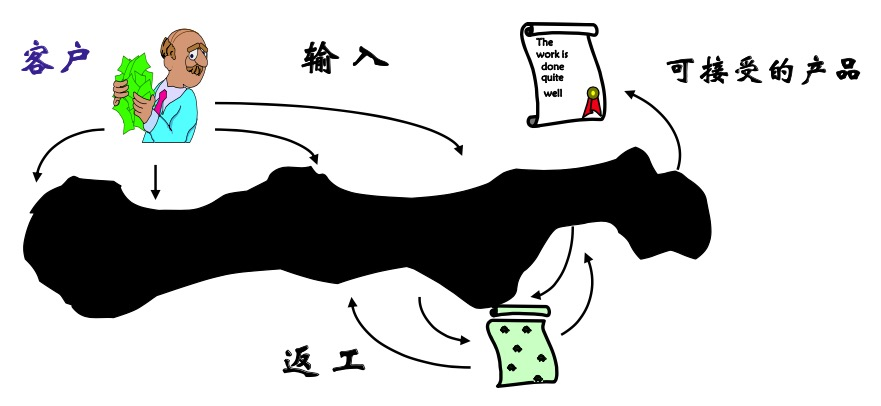
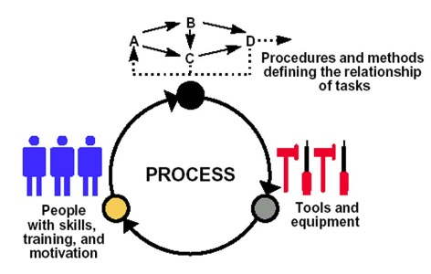
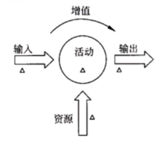
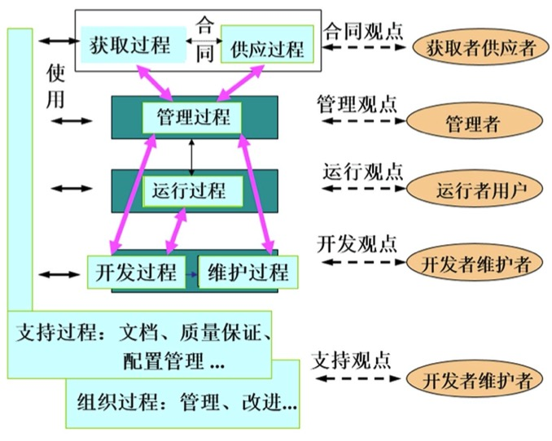
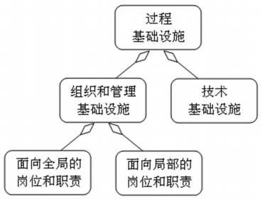

软件过程综述
---

--- 笔记整理自 北京理工大学 计算机学院

### 混沌的开发过程

    
     
    
备注：图片托管于github，请确保网络的可访问性

     

- 开发过程像是个黑盒，没有可视性，无从得知开发人员是否按照标准的开发过程进行软件开发活动
- 无法保证软件产品质量的稳定

### 过程思维

- 过程思维 vs 任务思维
- 过程思维注重
    * 过程思维的意识
    * 总体目标
    * 各部分工作的协调性和一致性
- 面向任务的思维注重 
    * 传统思维模式
    * 注重任务和作业
    * 注重人员和组织结构
    * 忽略了当各个局部之间矛盾出现冲突的时候,再去着手解决,导致低效和内耗发生
- 软件质量保证与过程思维相关 
- 软件质量控制与任务思维相关

### CMM之父谈软件过程

- Watts Humphrey (1927~2010)
- 过程质量决定产品质量
- 过程应该可控制，可度量和可改进
- 软件过程是工具、方法和实践
- 软件过程管理的目标是生产出好产品 
- 成本估算和开发期承诺应该是合理的 
- 有效的软件管理应考虑多种因素
    * 任务
    * 方法
    * 工具
    * 参与工作的人员技能
    * 积极性
- 有效的软件过程必须是可预测的

### 什么是过程

- 过程就是人们使用相应的方法、规程、技术、工具等将原始材料(输入)转化成用户需要的产品
    * 基本过程类(获取过程、供应过程、开发过程、运作过程、维护过程、管理过程)
    * 支持过程类(文档过程、配置管理过程、质量保证过程、验证过程、确定过程、联合评审过程、审计过程、问题解决过程)
    * 组织过程类(基础设施过程、改进过程、培训过程)

    
     
    
备注：图片托管于github，请确保网络的可访问性

     

### 过程要素

- 输入(业务需求)和输出(用户满意的产品)
- 活动及进一步分解的任务
    * 活动完成了从输入到输出的增值过程
- 资源:人员、设备及相关的耗费
    * 为了完成任务需要的资源
- 测量与验证
    * 保证开发过程按照规范的要求来进行
    * 测量可以是从活动或者是工作成果中获取相关的质量特性并和预期值作比较
    * 满足预期值则合格，不满足则不合格
- 过程目标: 增值
    * 最大限度的控制成本，提高质量取得最大的增值效果
- 核心问题 
    * 做什么
    * 谁来做
    * 怎么做

    
     
    
备注：图片托管于github，请确保网络的可访问性

     

### 过程之间的关系

    
     
    
备注：图片托管于github，请确保网络的可访问性

     

- 软件开发过程可以分为基本过程，实施过程，组织过程
- 不同的人员从不同角度关注各自的子过程
- 获取者和供应者以合同的观点来关注获取过程和供应过程
- 开发运维人员从开发观点关注开发过程和维护过程，同时可以以支持的观点来关注支持过程和组织过程
- 而支持过程、组织过程则关系着整个软件生产过程，为其他过程提供服务和支持
- 过程思维要求我们有全局的观念，不仅考虑自身关注的和各个过程的协调性和一致性，从而获得整体的成功

### 过程成熟度与过程能力

- 所有软件开发企业都有自己独特的软件开发过程
- 如何衡量一个软件过程的优劣?
- 过程成熟度：特定软件过程得到清晰的定义、管理、测量、控制的有效程度
- 软件过程能力是指软件开发过程能够达到的能力，包括可达到的质量、效率、工期、成本等
- 成熟度意味着能力的增长潜力
- 成熟软件组织的能力是已知的
- 成熟的过程需要规范化

### 成熟与不成熟的过程

- 角色与职责：明确与否
    * 不成熟：没有明确角色和职责，常会发现重叠，不清楚的所属关系和责任
    * 成熟：有明确的规定和职责，项目之间关系没有重叠，有明确目标和测量方法能够持续改进过程
- 处理变更的方式：做事依据
    * 不成熟：每个人按自己的想法做事，无秩序的混乱现象随处可见
    * 成熟：大家遵守一个规划好的，相互之间分享取得的经验
- 对发生问题的反应：救火还是防火
    * 不成熟：每个人都想当英雄
    * 成熟：专业的规则和熟练的知识对问题进行分析和处理
- 可信性：估算是否有效
    * 不成熟：经常延迟交付产品，超出预算
    * 成熟：估算较为准确，项目可以得到有效的控制管理，目标一般都能达到
- 对人员的奖励：救火者or防火者
    * 不成熟：奖励救火员(头痛医头，脚痛医脚，没有本质解决问题的人)
    * 成熟：奖励的是防火者(生产效率高，质量高的团队)
- 预见性：进度和预算
    * 不成熟：质量往往不可把握，依赖个人，不能根据以往的经验来确定
    * 成熟：项目进展和产品质量都可预见，进度和预算可根据以往经验来确定，符合实际情况

### 过程制度化

- 规范化过程渗入组织日常生活中，过程的要求已变成全体员工自觉的行动，得到大家认同和坚持遵循的原则，过程便成为制度化
- 做到这些并不容易，要靠过程文化和过程基础设施的支持
- 过程从规范化到制度化
- 过程文化对制度化的支持
    * 过程文化：人们的习惯，思维受到过程思维和过程管理原则的影响，人们对规范化的过程是完全认同的
- 过程基础设施对制度化的支持
    * 基础设施：支持软件过程的基础框架和结构基础，包括组织和管理的岗位职责，支持定义的过程，开展过程的活动，获取分析过程反馈，不断进行过程改进所必须的工具和平台
    * 组织和管理基础设施：建立，监控，推进过程活动的岗位和职责，支持过程的岗位和职责又有面向全局和局部的工程组
        * 全局：公司级上工作，归属软件工程过程组
        * 局部：项目级上工作或某个特定的关键过程域上工作
    * 技术基础设施
- 全职与兼职
    * 全职：比如：软件工程过程组
    * 兼职：比如软件过程改进组

    
     
    
备注：图片托管于github，请确保网络的可访问性

     

### 过程特性

- 过程应当被定义 —— 文档化
    * 仔细思考总结，提出不确定因素
- 过程应当被人们掌握 —— 相关人员必须通过学习掌握过程
    * 不被理解和掌握的过程是没有实际意义的
    * 掌握一个复杂的过程是不易的，需要对过程自身的认识和培训，还要掌握相关的技能
    * 需要对相关人员进行充足的培训才能掌握
- 过程必需被实施 —— 通过实践见成效，发现新问题，不断改进
- 过程应当可监控 —— 过程的可视性
    * 如果过程不可视，不可控就是一个混沌的过程
    * 无法消除恐惧感，无法对过程进行度量和改进

