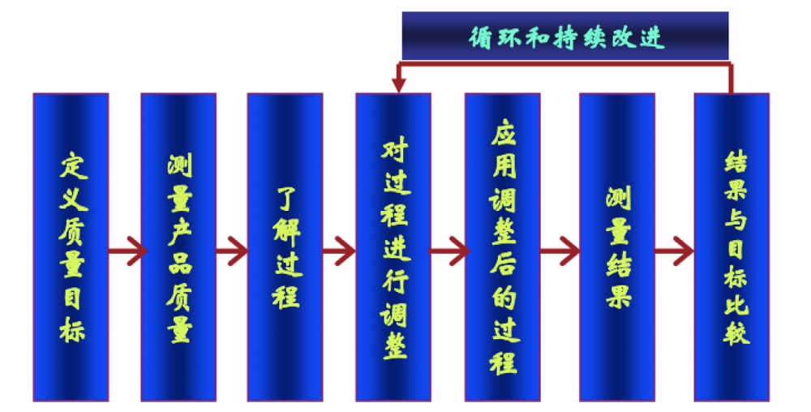
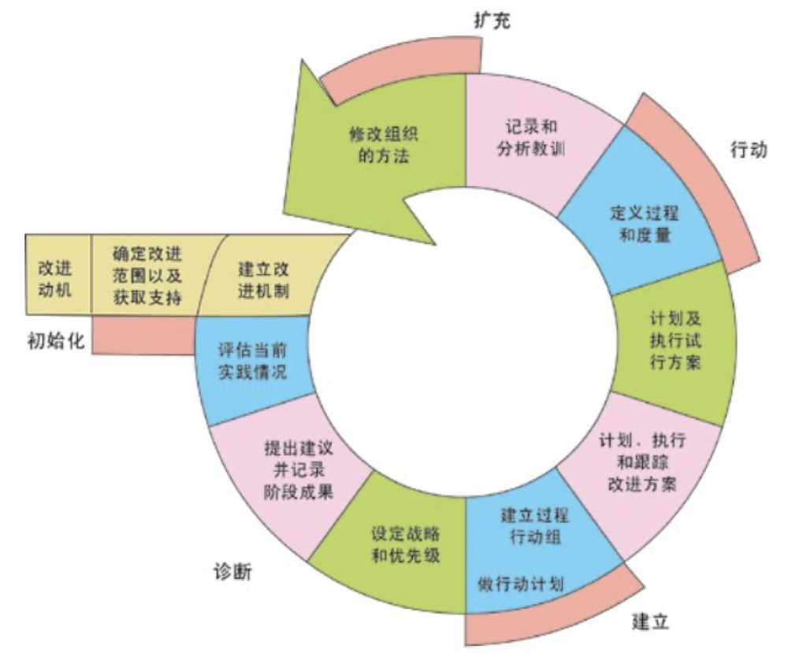
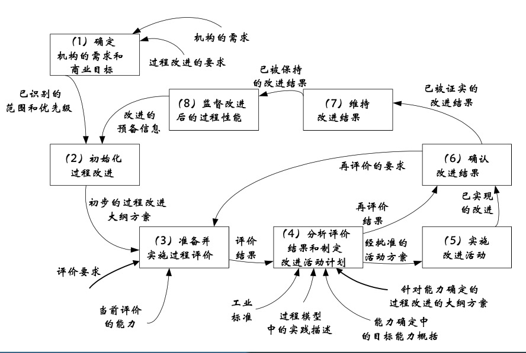

软件过程改进
---

--- 笔记整理自 北京理工大学 计算机学院

### 软件过程开发

- 不同于软件工程开发过程
    * 软件过程也是软件
    * 软件有个开发的过程，软件开发产出的是软件产品，是个演进的过程，是软件产品不断升级更新
    * 软件过程也有个开发的过程，软件过程开发产出的是过程产品，也是一个演进的过程，是过程的不断升级和更新，成熟度不断提高
    
- Leon Osterweil教授在1987年第9届世界软件工程大会上提出: Software Processes are Software Too
    * 开发过程 
    * 产品 
    * 演进

### 软件过程质量

- 开发出高质量的软件过程
- 质量是指“某一事物的特征和属性” 
    * 质量是指一个事物的特征和属性，这种特征和属性是可度量的，可与已知的标准进行比较
    * 可度量
    * 可与已知标准进行比较
- 软件过程质量表现形式
    * 软件过程和软件产品一样，都属于知识或信息的实体，在质量方面的定义和描述具有一定的复杂性
    * 静态: 同McCall质量模型特性
        * 软件过程以某种特定的描述性质存在的时候，过程质量表现为静态的一面
        * 过程质量就是软件过程描述本身所具备的属性，它表现为功能性，满足实际需要的长度
        * 易用性表示用户使用这个过程描述进行过程实施和运作所需要的努力程度，其中包括易理解性和易学习性等子特性
        * 准确性表示特定类型的软件过程的准确程度，包括：精确性，一致性，完整性，冗余度等子特性
        * 易维护性表示用户在改进基于该描述形式的软件过程时，所需要的容易的程度，包括：易分析性，易修改性等子特性
    * 动态: 过程(运作)能力
        * 当软件过程在执行运作时，过程质量表现为动态的一面
        * 以软件质量表现出来的过程运作能力来衡量，包括：
        * 过程运作能否达到预期目标，是否保障软件产品的质量等
        * 简称为过程能力

### 软件过程度量

- 软件过程度量 
    * 为过程控制、评估和改善提供定量性基础 
    * 与软件开发流程密切相关
- 过程度量与产品度量有根本的区别
- 软件过程度量内容 
    * 成熟度度量：组织度量、资源度量、培训度量、文档标准化度量、数据度量、分析度量、过程质量度量等
    * 管理度量：项目管理度量、质量管理度量、配置管理度量等
    * 生命周期度量：问题定义度量、需求分析度量、设计度量、制造度量、维护度量等
- 软件过程度量的主观性和客观性
    * 客观性：所得到的关于某个对象的度量值是概略性的真实描述
    * 主观性：所得到的关于某个对象的度量值是由主观对象的度量判断得到的，所得到的度量值会因度量者的不同而不同，如系统的易学习性
- 软件过程度量也是软件过程评估的基础

### 软件过程评估

- 以一系列的标准对软件过程的质量进行评定而使软件过程不断改进和优化的系列活动
- 评估目的:发现过程缺陷，认知过程能力、比较过程能力和改进过程能力
- 软件过程评估方法
    * 过程度量数据
    * 问卷调查
    * 实际走查
- 过程评估是过程改进的基础

### 软件过程改进

- 过程改进是在软件过程工程中为了更有效地达到优化软件过程的目的，所实施的改善或改变其软件过程的系列活动
- 过程改进的目的是建立和维护企业级，项目级的过程，该过程在组织内达到改进的共识
- 过程改进的模式
    * 目标驱动模式：根据预先规定的目标, 自己向下的制定过程度量和评价模型，有目的的开展相关的改进的活动
    * 缺陷驱动模式：根据过程实施的时候产生的关于过程缺陷的反馈信息来针对性的改进过程的改进模式

    
     
    
备注：图片托管于github，请确保网络的可访问性

     

### 过程改进模型IDEAL

- 基于CMM模型的过程改进方法论
- Initiating (启动) 
    * 过程改进，约定启动资源，建立过程的基础设施
    * 建立管理操作组和软件工程过程组
    * 形成一个问题发现小组来研究有关的问题并把软件过程的改进建议交给高层管理者
- Diagnosing (诊断) 
    * 建立当前过程的说明，度量等并启动相关计划开发
- Establishing (建立) 
    * 建立目标，优先权，完成启动计划的开发
- Action (行动) 
    * 研究开发过程问题的解决方案并把过程改进意见扩散到整个组织
- Learning (学习)
    * 再次通过IDEAL模型把学到的经验和教训运用到整个领域，完善软件开发过程

    
     
    
备注：图片托管于github，请确保网络的可访问性

     

### 过程改进的通用步骤

    
     
    
备注：图片托管于github，请确保网络的可访问性

     

