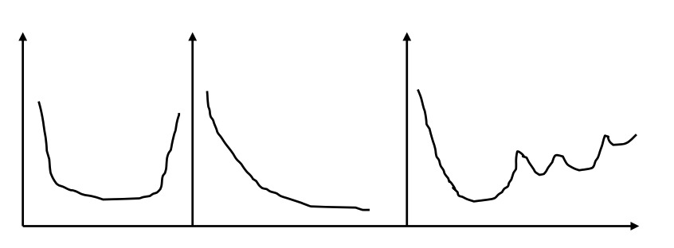
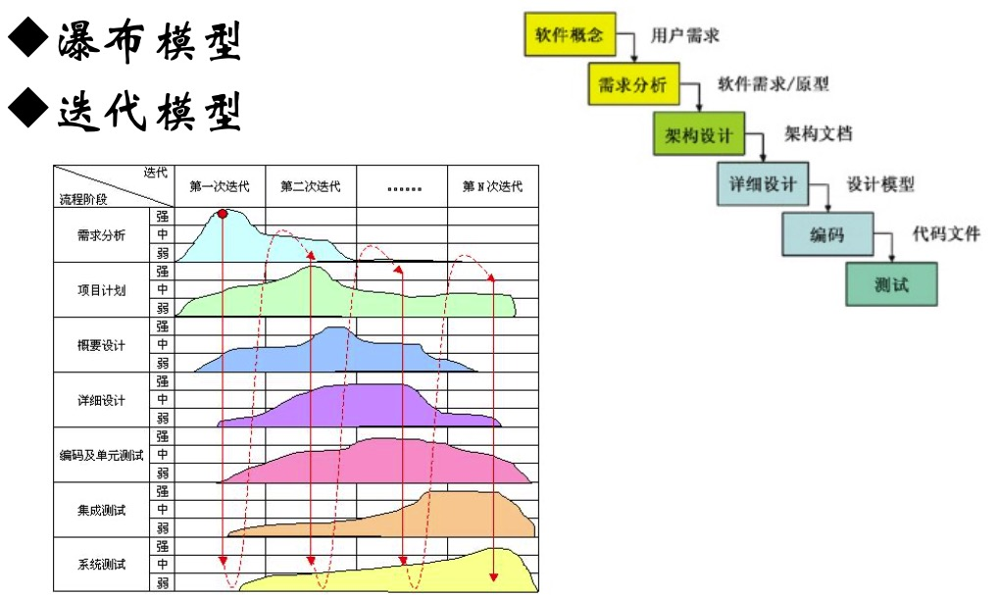
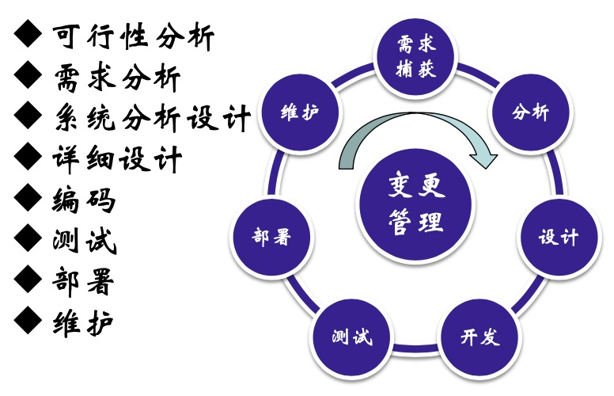
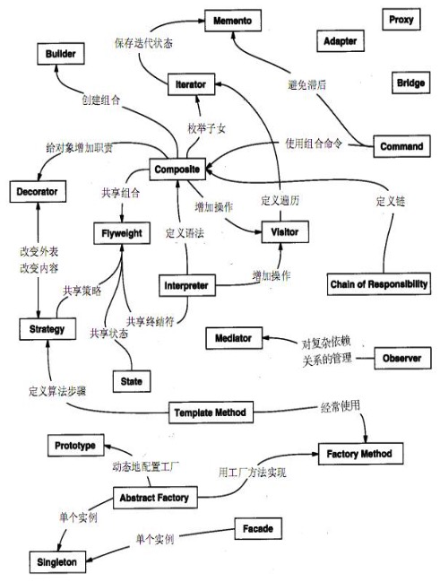

万变不离其宗
---

--- 笔记整理自 北京理工大学 计算机学院

### 软件开发中的一则小故事

1. 程序员写出自认为没有Bug的代码。
2. 软件测试，发现了20个Bug。
3. 程序员修改了10个Bug，并告诉测试组另外10个不是Bug。
4. 测试组发现其中5个改动根本无法工作，同时又发现了15个新 Bug。
5. 重复n次步骤3和步骤4。
6. 鉴于市场方面的压力，为了配合当初制定的过分乐观的发布时间表， 产品终于上市了。
7. 用户发现了137个新Bug。
8. 已经领了项目奖金的程序员不知跑到哪里去了。
9. 新组建的项目组修正了全部137个Bug，但又发现了456个新Bug。
10. 最初那个程序员从斐济给饱受拖欠工资之苦的测试组寄来了一张 明信片。整个测试组集体辞职。
11. 公司被竞争对手恶意收购。收购 时，最终版本包含783个Bug。
12. 新CEO走马上任。公司雇了一名 新程序员重写该软件。
13. 程序员写出自认为没有Bug的代码。

### 软件开发周期

软件开发的基本活动相同，但组织方式不同，构成了不同的软件生存(开发)周期模型。参考之前的项目管理博文

基本都是：需求分析，系统分析设计，编码测试，无论怎么开发，这些活动总得有

### 软硬件(故障)生存曲线

    

备注：图片托管于github，请确保网络的可访问性

第一种是浴缸模型，开始生产硬件的的时候各种问题，经过一段磨合之后逐渐趋于稳定，最后由于寿命快结束了，故障又多了起来

第二种是理想的软件模型，开始的时候很多故障，随着不断的修复, 故障越来越少

第三种是实际的软件模型，开始的时候很多故障，随着不断修复，故障少了起来，加入新的功能后，故障又多了起来，再次进行修复，再次加入新的功能，再次故障，再次修复等等

### 典型的开发周期模型

    

备注：图片托管于github，请确保网络的可访问性

瀑布模型有一个特点，水往低处流，不能再回来，也就是顺序进行的，一直往前走，不回头

迭代模型的特点是，逐步完善，随着迭代的增加，整个项目越来越完善

### 软件开发的基本活动

    

备注：图片托管于github，请确保网络的可访问性

这里将一条直线变成了一个圆，将变更管理作为轴心，滚动前进

### 阶段一：可行性分析

解决的是做和不做的问题

要考虑的一些因素：

1. 钱的问题，是否挣钱，以盈利为目的，以及其他因素
2. 技术问题，员工技术能力能否搞定，当今的技术能否可以实现，包括当前的一些，算法，AI, 大数据，云计算, 区块链等等
3. 社会环境，市场是如何，国内国际相关政策是否支持，更多的是商业问题
4. 人的问题：有四类：公司领军人物，各个领域的精英人才，人手是否足够，人精(公关营销,售前售后等) 各司其职

### 阶段二：需求分析

解决的是做什么的问题

1. 捕获客户心中到底要做什么，一般很难捕获，客户可能自己都不知道要做什么
2. 捕获后记录下来，通过客户反馈，反复与客户确认
3. 开始进行分析，比如使用UML用例，非形式化的自然语言对需求的描述

### 阶段三：系统分析与设计

解决的是怎么做的问题

1. 体系结构：比如北京的交通图，用的是环路结构，还是棋盘设计，各有什么优缺点
2. 模块：它是一种分解的思想，一开始解决不了，我们分解成模块，每个模块有什么关系, 比如数据库的设计，如何分库，分表
3. dsa：数据结构与算法，不同的数据结构，需要不用的算法支持，比如百度，谷歌，bing等的搜索引擎，他们的算法是不一样的，结构也不一样
4. 界面：界面需要符合一定的规则, 比如键盘的设计, App的设计，环节的跳转，游戏界面的展示

### 阶段四：详细设计

解决的也是怎么做的问题，这里会更细化一些

    

备注：图片托管于github，请确保网络的可访问性

可能包括：某个算法，某个伪代码的实现，结构的明确等等

### 阶段五：编码阶段

目前世界上存在各种编程语言，不同的语言又不同的特点，一个程序员想要精通各种编程语言，几乎是不可能的，什么样的场景选择使用什么语言和相关框架

### 阶段六：测试阶段

这是一个亡羊补牢的阶段！

给你一台冰箱，你该如何测试？

常规(冰箱门是否可以正常打开, 是否能够正常制冷等等) + 极端(电压不稳，是否正常, 断电后还能运行多久等等) = 通过

测试内容：单元测试(程序员来做)，集成测试，系统测试，功能测试，性能测试，压力测试，回归测试

### 阶段七：部署

开发环境与生产环境

软件本身Bug

支持环境兼容性问题(OS，数据库等) 

自动化部署(降低部署成本)

### 阶段八：维护

改正性：bug类

适应性：用户环境变化, 做的调整

完善性：占比越来越高，用户需求变更，从开发阶段到维护阶段

预防性：千年虫问题

### 管理活动贯穿整个周期

管理这个因素太重要了

二八理论：20%的高端用户提供80%的利润；技术人员应掌握80%的技术 + 20%的管理

被管理者也应具有管理的思维，学习软件工程，管理与被管理的技巧

牧羊与牧猫：羊很乖，但猫不一样，程序员就像是猫一样，有激情，有个性，如何差异性管理

在一个小型敏捷开发团队中，手下成员大概有5~9人，建议是7人是最合理的配比