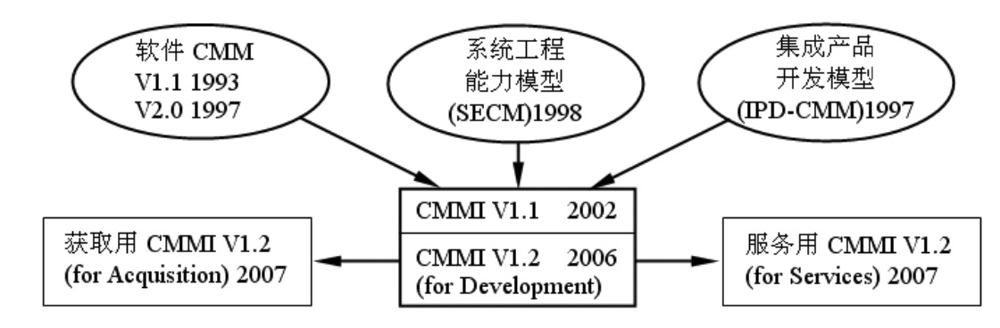
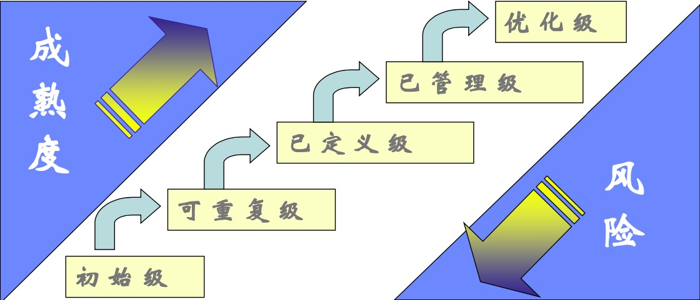
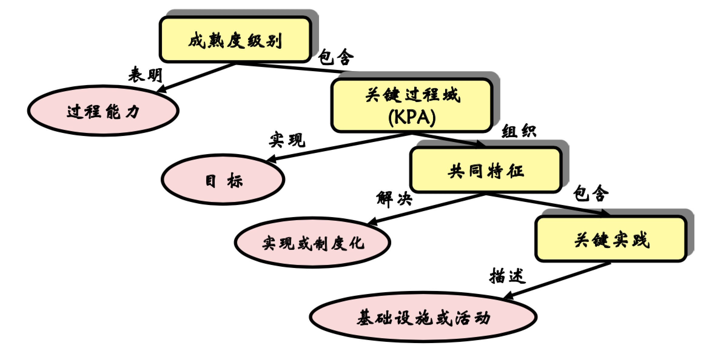
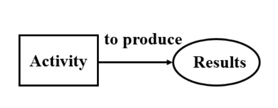
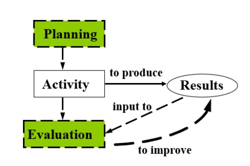
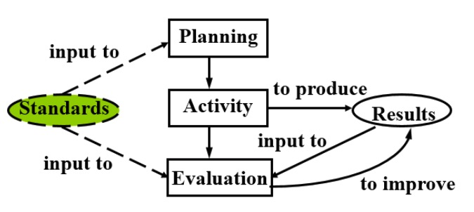
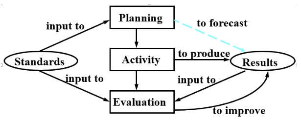
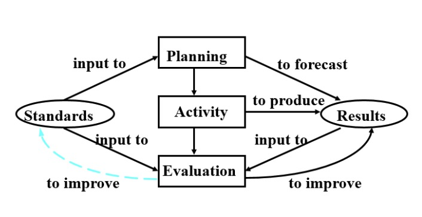

能力成熟度模型
---

--- 笔记整理自 北京理工大学 计算机学院

### CMM产生的背景

- 急需对软件企业工程能力进行评价
- CMM的起源
    * 1987年SEI研究组发表论文:“承包商软件工程能力的评估方法”
        * 包含5级的软件能力成熟度模型
        * 承包商至少是3级
    * 1991年CMM1.0
    * 1993年CMM 1.1
    * 1997年 CMM2.0(并入CMMI)
- 成为企业内外能力衡量的标尺

### CMM与CMMI

- 出现了多个基于CMM的相关模型 
- CMMI把CMM家族打包集成
- CMMI家族进一步扩充和发展
- CMMI目前分为三种模型
    * DEV 开发模型
        * 帮助生产服务开发组织整合软件开发和系统工程改进自身性能，提高过程改进的效率
    * ACQ 获取模型
        * 帮助组织为客户进行外包，采购，交易等服务提供管理架构
    * SVC 服务模型
        * 帮助服务型组织建立质量服务的过程架构，更好的改进服务表现，提高企业服务收益

    
     
    
备注：图片托管于github，请确保网络的可访问性

     

### CMM五级模型

    
     
    
备注：图片托管于github，请确保网络的可访问性

     

- 软件开发人员并不关心采购，交易，服务等，关心的是软件开发过程的评估和改进
- 随着等级提高，逐步降低了软件开发风险，缩短软件开发时间，减少了软件开发的成本，降低灾难性的错误发生率
- CMM评估等级的提高会大幅度提升软件开发能力，有助于客户特别是大公司对它的评估企业建立信心

### CMM中的关键概念

    
     
    
备注：图片托管于github，请确保网络的可访问性

     

- CMM每个等级通过三个层次加以定义
    * 关键过程域
    * 关键实践类
    * 关键实践
- 成熟等级表明企业的过程能力
- 每个成熟等级包含若干个对该成熟度等级至关重要的过程域，它们的实施为达到企业的成熟度等级的目标起到保证的作用
- 这些过程域称为这个成熟度等级的关键过程域，每个关键过程域都有一些特定的目标
- 每个目标概括了关键过程域的关键实践，表名每个关键过程域的范围，边界和意图
- 为了实现这些目标，每个关键实践类规定了相应部门或有关责任者应该支持的一些关键实践
- 当关键过程域的关键实践都得到实施的时候，就能够实现这些关键过程的目标
- 关键实践为组织描述了为有效实施并规范化关键过程域应该具备的技术设施或活动
- 关键实践为关键过程域的实施起关键作用的方针，规程，测试，活动以及相关基础设施的建立
- 关键实践一般描述做什么，而不强制约定如何做

### CMM模型——初始级

- 软件过程混乱无秩序的 
- 对过程几乎没有定义
- 成功依赖个人才能和经验 
- 管理方式属于反应式，缺乏健全的管理制度，导致软件产品质量不稳定
- 没有关键过程域

    
     
    
备注：图片托管于github，请确保网络的可访问性

     

- 这张图表示活动产生结果，产品的成功依赖个人能力

###  CMM模型——可重复级

- 这一级别企业建立了基本制度和规程，管理工作有章可循，初步实现过程标准化
- 开发工作可以比较好的按照标准来实施，变更按照规则进行，做到了机械化
- 产品质量稳定可追踪
- 具有基本的项目管理过程
- 过程是有效的
- 关键过程域: 需求管理，软件项目策划，软件项目跟踪与监督，软件子合同管理，软件质量保证，软件配置管理

    
     
    
备注：图片托管于github，请确保网络的可访问性

     

- 这张图可看出在一级的基础上增加了计划和评估部分，开发过程不再随心所欲，而是要根据制定好的计划，规范来进行
- 评估结果可进一步提高产品的质量

###  CMM模型——已定义级

- 这一级别的企业具有遵守标准的能力而不具有修改标准的能力
- 管理活动和功能活动两方面的软件过程均已文档化和标准化，并集成到组织一级的标准软件过程中
- 形成了标准软件过程
- 全部项目均采用经批准的剪裁版本，整个组织的过程能力是标准的和一致的
- 关键过程域: 组织过程焦点、组织过程定义、培训大纲、集成软件管理、软件产品工程、组间协调以及同行评审

    
     
    
备注：图片托管于github，请确保网络的可访问性

     

### CMM模型——已管理级

- 采集和分析软件过程的度量数据，有了这些数据可以减少过程性和变化性
- 关键过程域:定量过程管理、软件质量管理 
- 设置了定量的质量目标
- 项目产品质量和过程是受控和稳定的
- 开发新领域软件的风险可定量估计
- 过程能力可定量预测

    
     
    
备注：图片托管于github，请确保网络的可访问性

     

### CMM模型——优化级

- 新思想，新技术提供了改进保证
- 组织关注点:持续的过程改进
- 关键过程区域:缺陷预防、技术改革管理、过程变更管理

    
     
    
备注：图片托管于github，请确保网络的可访问性

     

### SCAMPI评估

- CMMI评估方法SCAMPI(Standard CMMI Appraisal Method for Process Improvement)
- SCAMPI分为ABC三级
    * A级是最严格的，是唯一正式的评估方法
    * B级总体要求和A类似，适用于过程改进进行一段时间之后的检查
    * C级主要用于第一次评估，特别是企业没有CMM和CMMI经验的时候
- SCAMPI评估必须由经过SEI授权主任评估师主持
- 评估三个阶段
    * 计划和准备阶段：确定评估等级目标，建立责任人
    * 现场阶段：执行评估，根据第一阶段制定的计划，采集分析，确定发现的问题，主要是采集覆盖所有过程域项目周期的整个阶段, 同时又能表征组织能力的过程数据，需要多次采集重复活动
    * 报告结论阶段：评估组织向被评估组织提交一份评估结论，根据组织要求归档相应的评估资料，并按计划要求对部分信息进行保密处理

