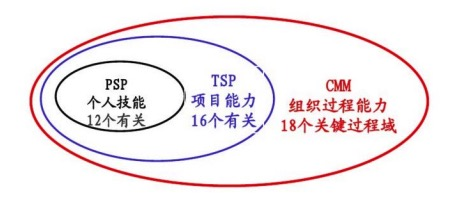
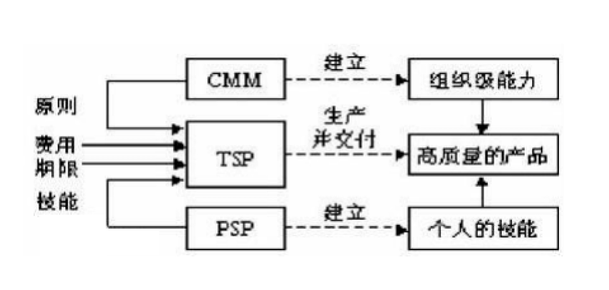

过程改进标准框架
---

--- 笔记整理自 北京理工大学 计算机学院

### 双模认证SPCA

- 软件过程及能力成熟度评估
- SJ/T 11234《软件过程能力评估模型》
    * 针对软件企业对自身软件过程能力进行内部改进的需要
    * 有22个过程分为4个大类：过程管理类，项目管理类，工程管理类，支持类
    * 过程能力从0~5分为6个等级，每个等级包含了通用目标，通用管理，特定目标，特定惯例组成一整套的衡量准则
    * 按照这些准则，对于软件过程的评估，就可以确定当前软件工程的能力状态
- SJ/T 11235《软件能力成熟度模型》
    * 也有22个方面，分为1~5级来描述综合软件能力
- 软件工程及能力成熟度评估指南
    * 评估过程有经过培训的专业队伍以评估参考模型作为确定过程强项和弱项的基础
    * 对一个或多个过程进行检查

### 6西格玛

- 90年代中期由摩托罗拉提出
- 从全面质量管理方法演变为过程设计、改善和优化技术
- 一个企业要达到6西格玛的标准出错率不能超过百万分之3.4
- 经典案例: dabawallah 午餐速递系统，差错率控制在八百万分之一
- 精益六西格玛
    * 精益生产和六西格玛结合起来的产物
    * 通过整合精益生产和六西格玛管理，提取两种生产模式的优点，弥补了单个生产模式的不足，达到了更佳的管理效果
    * 不是两者的简单相加，是两者的相互补充和有机结合

### 从CMM到PSP和TSP

- CMM针对大企业
- CMM需要裁剪才能使用(小型企业需要裁剪使用)
- CMM是过程改进的第一步，它提供了评价组织的能力，识别优先改善需求和追踪改善进展的管理方式
- CMM并未提供有关实现CMM关键过程域所需的具体知识和技能
- Watts Humphrey将CMM思想用于
    * 个人： PSP(Personal Software Process)
        * 个人软件过程
        * 使用PSP可以得到优异的结果，但是周围的环境不能鼓励要求遵守PSP实践，那么规范性是不可能得到维持
    * 项目组：TSP(Team Software Process)
        * 团队软件过程(群组软件过程)

### CMM/TSP/PSP框架

- 集成的软件过程改进框架
    * CMM提供了框架和目标
    * PSP针对个人进行优化
    * TSP针对团队进行优化

    
     
    
     
    
备注：图片托管于github，请确保网络的可访问性

     

### PSP-自我改进过程

- PSP （Personal Software Process ）
- 一种可用于控制、管理和改进个人工作方式的自我改善过程
- 一个包括软件开发表格、指南和规程的结构化框架
- 个体软件过程的原则
    * 帮助做计划
    * 确定步骤
    * 建立基准
    * 确定影响
- 从PSP0到PSP3
    * PSP1，个人计划过程，在PSP0的基础上增加了计划步骤
    * PSP2，个人质量管理过程，强调设计接受的准则
    * PSP3，将个人软件过程应用扩展到大规模的软件过程当中

### TSP-群组改进过程

- TSP（Team Software Process）关注点
    * 如何创建高效且具有自我管理能力（PSP）的团队
    * 工程人员如何才能成为合格的项目组成员
    * 管理人员如何为团队提供指导和支持
    * 如何保持良好的工程环境
- TSP的四条基本原则
    * 应该遵循一个确定的可反复的过程，迅速获得反馈，让学习和改革富有成效
    * 一个群组是否高效是有明确的目标，有效的工作环境，有能力的教练，积极的领导四方面的因素综合作用，不能偏离任何一个方面
    * 及时总结经验教训，让学员在项目中面临各种各样的实际问题，寻求有效的解决方案，会更加深刻的体会到PSP的威力
    * 借鉴前人和他人经验在工程科学、教学的经验基础之上来规定过程改进的指令
- TSP流程分为四个阶段
    * 任何应用TSP的项目可以只包含其中的一个或多个
    * 项目开始之前，项目组执行启动过程，对整个任务进行全面规划和组织
    * 在每个阶段之前，项目组应该执行重启过程，对下一个阶段的任务进行规划
    * 一般说来，项目组成员经过PSP的培训，项目组启动过程大约要3天时间
    * 重启过程大约需要2天时间
    * 项目组成员同管理人员一起评审项目计划，分析关键风险
    * 项目启动后每周进行一次项目进展讨论会，及时向有关主管和客户报告项目进展情况