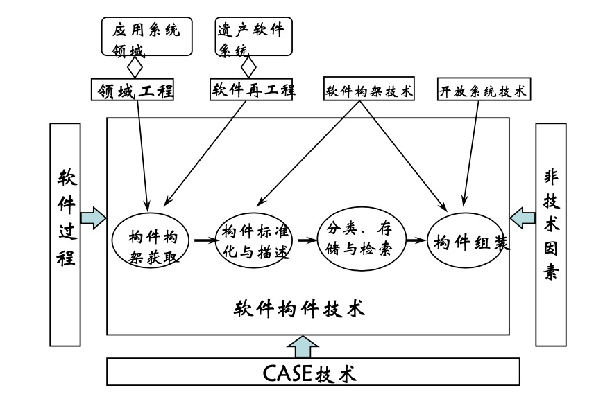
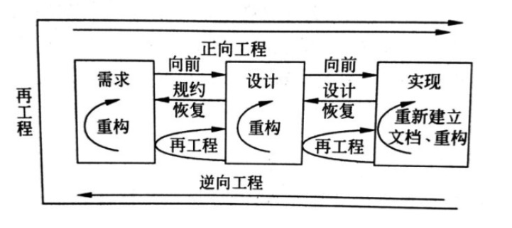

软件复用综述
---

--- 笔记整理自 北京理工大学 计算机学院

### 重复无处不在

- 代码拷贝是复用还是Bad Smells?
    * 代码坏味道排名第一的就是代码拷贝
    * 代码拷贝不是良好的复用方法，也足以说明我们对软件复用的需求
    * 系统在从头开发的时候一定会存在多多少少重复劳动
- 软件开发活动中存在大量的重复 
    * 需求获取重复
    * 设计重复
    * 编码重复
    * 测试重复 
    * 文档重复
- 避免重复劳动的解决方案?
    * 面向对象
    * 构建技术

### 软件复用的概念

- 1968年的一篇论文“大量生产的软件构件”
- 软件复用:重复使用“为了复用目的而设计的软件”的过程
- 可复用软件:为了复用目的而设计的软件
- 软件挽救和代码沿用
    * 软件挽救：重复使用并非为了复用而设计的软件那些活动
    * 代码沿用：在一个系统不同版本之间的代码重复的活动
    * 这么区分是为了避免使用*复用*这个词，免得把复用狭义、广义概念混淆
- 重复行为发生的维度 
    * 时间维—软件维护：使用以前软件的版本作为新版本的基础加入新的功能,适应新的需求
    * 平台维—软件移植：以某个平台的软件作为基础,修改和运行和平台相关的部分,使其能够运行在新的平台下，这就是软件移植
    * 应用维—真正的软件复用：将某个软件或软件中的某些部件应用到其他系统中去，新的系统具有不同的功能和用途，这是真正意义上的软件复用

### 软件复用的分类

- 按复用对象分类
    * 产品复用(主流的复用途径)
        * 狭义上来说：复用哪些已有的软件构建，通过构建集成得到新的系统
        * 广义上来说，包括以下几类：
          * 数据复用
          * 体系结构复用 
          * 设计复用 
          * 程序复用
    * 过程复用
        * 复用已有的软件开发过程
        * 使用可复用的应用生成器来生成或半自动生成我们所需要的系统
        * 依赖于软件自动化技术的发展，只适用于一些特定的应用领域
- 按复用方式分类
    * 黑盒复用：对已有的构件不做修改，可直接使用，理想的复用方式
    * 白盒复用：已有的构建不能完全符合业务需求, 需要根据业务的需求适应性修改(大多数情况下，适应性修改往往是必须的)
- 软件复用三个基本原则：
    * 必须有可复用的对象
    * 被复用的对象必须是有用的
    * 复用者需要知道如何使用被复用的对象
- 软件复用包括两个相关的过程
    * 可复用软件的开发
    * 基于可复用软件应用系统的构造

### 实现复用的关键因素

    
     
    
备注：图片托管于github，请确保网络的可访问性

     

- 软件构建技术领域工程
- 软件架构技术
- 软件再工程
- 开放系统技术
- 软件过程
- CASE技术
- 以及各种非技术因素

### 软件构件技术

- 构件是可组装的软件实体 
    * 具有相对独立功能
    * 可以明确辨识 
    * 接口由契约指定 
    * 和语境有明显依赖关系 
    * 可独立部署 
    * 多由第三方提供
- 可复用构件
- 构件概念的扩展

### 软件架构技术

- 架构与体系结构
- 架构是对系统整体结构设计的刻画 
    * 全局组织与控制结构
    * 构件间通讯
    * 同步和数据访问的协议
    * ...
- 软件架构研究内容 
- 研究和应用热点:SOA(面向服务的体系结构)

### 领域工程

- 一组具有相似或相近软件需求的应用系统所覆盖的功能区域
- 特定领域的软件复用比较容易成功 
    * 内聚性：保证领域有足够的共性
    * 稳定性：保证领域工程的投资可获得足够的回报
- 领域工程的三个主要阶段
    * 领域分析 -> 建立领域模型
        * 领域模型描述了领域当中系统之间的共同需求
        * 这阶段的主要活动包括：确定领域边界, 识别信息源，分析领域当中的系统需求
        * 确定哪些需求是可以广泛共享的，哪些需求是可以改变的，从而建立领域模型
    * 领域设计 -> 获得领域架构
        * 领域架构描述了在领域模型当中的解决方案
        * 它不是单个系统表示，而是一个高层次的设计
        * 能够适应领域中多个系统的需求
    * 领域实现 -> 定义翻译机制
        * 可以把需求翻译成由可复用构件所创建的应用系统
        * 根据所采用的复用策略和领域的成熟和稳定程度的不同
        * 这种机制可能是一组与模型和领域架构相关的可复用构件
        * 也可能是应用系统的生成器

### 软件再工程

- 软件再工程是指对原有的软件系统进行调查，分析将其重构为新系统的开发过程
- 最特色是：最大限度的重用原有系统的各种资源
- 软件再过程是一个工程过程
- 组合了逆向工程、重构和正向工程 
- 再工程的基础是对原有系统的理解，包括：运行系统，源代码，设计，分析，文档等的全面理解
    * 很多情况下是文档的丢失，只能对源代码进行再理解

    
     
    
备注：图片托管于github，请确保网络的可访问性

     

### 其他因素

- 开放系统技术 
    * 使用标准接口
    * 分布对象技术
- 基于构件复用的软件过程
    * 对软件质量和开发效率的影响
    * 不同于传统的软件过程
- CASE技术
    * 与软件复用相关的研究内容：可复用构件的提取，描述，分类，存储，检索，组装，度量等等
- 非技术因素
    * 机构组织和管理方法如何适应复用的要求
    * 开发人员知识更新和心理障碍的克服
    * 知识的产权问题，标准化问题等等