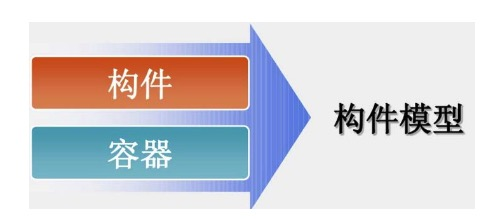
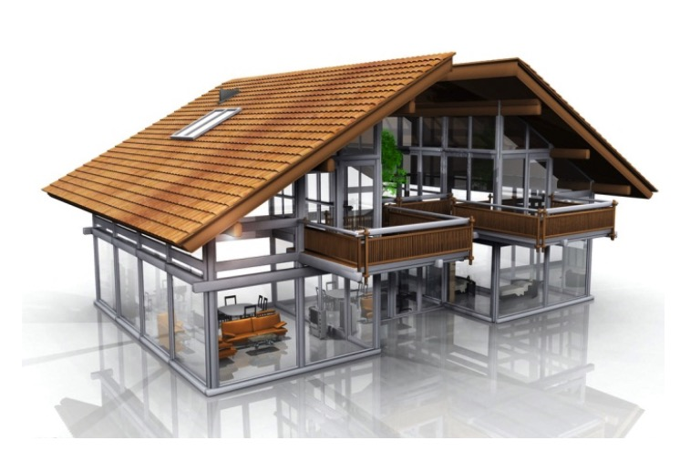
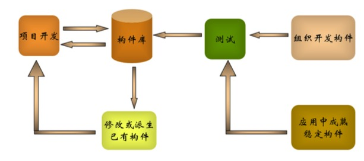
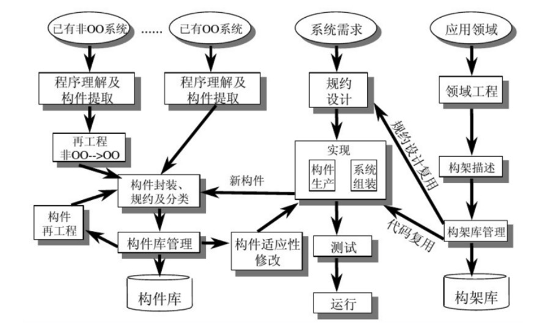

软件构件技术
---

--- 笔记整理自 北京理工大学 计算机学院

### 构件化开发案例

- 大连路隧道监控系统开发
- 工期9个月，代码29:35.85，效率提高5.2倍
- 大量复用成熟构件
    * XCOM2.0实时通讯中间件
    * MultiLink1.9 PLC通讯中间件
    * ePass1.2授权认证中间件
    * BSMQ2.0消息队列
    * VFC1.2画面框架
    * CTCS1.0城市交通指挥
    * Call Center 2.0呼叫中心

### 复用的成功与失败

- 成功复用的场景
    * 在较小的特定领域
    * 在理解充分的领域
    * 当领域知识变动缓慢时
    * 当存在构件互联标准时
    * 市场规模和技术规模形成
- 失败复用的主要原因 
    * 缺乏对复用的管理支持
    * 没有复用激励措施
    * 没有强调复用问题的规程或过程
    * 没有足够的可复用资源
    * 没有良好的分类模式，使得构件查找比较困难
    * 没有构件库支持和控制复用
    * 构件库中的构件没有良好的接口

### 可复用构件属性

- 有用性：构件必须提供有用的功能
- 可用性：构件必须易于理解和使用
- 质量：要求构件及其延伸构件必须能够正确的工作
- 适应性：要求构件应该能够通过参数化等方式在不同的语境中进行配置
- 可移植性：构件应该能够在不同硬件平台和软件环境下正常工作

### 软件构件模型

- 软件构件模型是对软件构件本质特征的抽象描述，是对开发可重用软件构件和构件之间相互通信标准的描述
- 构件模型由构件和其容器构成
    * 容器为构件提供通信和关联的规范
- 与构件部署/实现相关模型
    * 帮助人们决定如何使用某种程序设计语言或以某种可执行单元的形式来实现构件，这类模型也被称为基础设施模型
- 与构件规约/组装相关模型
    * 描述构件的规约和目标，说明构件可以对外提供哪些功能, 构件需要外界对它提供哪些功能, 构件用于哪种语境，构件如何被定制等
- 与构件分类/描述相关模型
    * 这类模型以综合的方式来描述构件，用于管理大量的静态构件，使得构件易于被用户所理解，易于在构件库中有效的进行分类，存储和检索
    * 本质上来说，这类模型就是构建库的信息模型

    
     
    
备注：图片托管于github，请确保网络的可访问性

     

### 典型构件模型

- CORBA公共对象请求架构 
    * 分布式对象机制
    * 提供公共服务规范
    * CCM构件开发模型
- EJB企业级JavaBean模型 
    * JavaBean
    * EJB 
    * RMI
- COM构件对象模型 
    * OLE,COM,ActiveX,DCOM,COM+

    
     
    
备注：图片托管于github，请确保网络的可访问性

     

### CBSD开发方法

- 需求分析和构件的评选
- 构件的剪裁和扩展
- 构件的测试
- 构件的装配和集成
- 应用系统的部署
- 系统的演化

    
     
    
备注：图片托管于github，请确保网络的可访问性

     

### 青鸟软件生产线示例

    
     
    
备注：图片托管于github，请确保网络的可访问性

     

- 青鸟工程经历了国家的4个五年计划
- 研究开发具有自主知识产权的软件工程环境
- 为软件产业提供基础设施：工具，平台，环境
- 以手工作坊式转向为计算机辅助式，提高软件开发效率，改善软件产品质量
- 采用面向对象技术，研究基于构建和构建模式的软件生产技术
- 制定了符合国情的，国际兼容的青鸟构件标准规范
- 支持专业化的构件生产，架构开发
- 提供强有力的构件库的管理
- 采用基于构件架构复用的应用系统集成技术
- 为软件开发组织提供组织，管理，技术，支撑，四位一体的支持
- 上图可分为左中右三部分
- 左边的主要活动是生产构件
- 右边的是生产构架
- 中间的是根据需求使用构架和构件组装成应用系统

### 构件的标准化

- 标准化是产业化的必由之路
- 硬件的标准化已经成功了
- 软件标准化的关键因素
    * 标准构件的生产
    * 构件的复用是

### 构件库

- 构建国家级构件库的重要性
- 构件相关信息
    * 构件的语义描述：描述构件功能和用途
    * 构件的分类：类型，包括类，类库，框架，模块等等
    * 构件的形态 
    * 构件的技术环境：开发工具，方法，部署环境等
    * 构件的形式：源代码，二进制代码等等
    * 构件的状态：版本，历史等时间相关的属性
- 构件的操作
    * 添加、检索及管理

### 软件构件技术研究内容

- 构件获取:生产与提取
- 构件模型:构件特征与构件间关系
- 构件描述语言:构件描述
- 构件分类与检索:构件库管理
- 构件复合组装:组装机制
- 标准化:构件和构件库标准化
