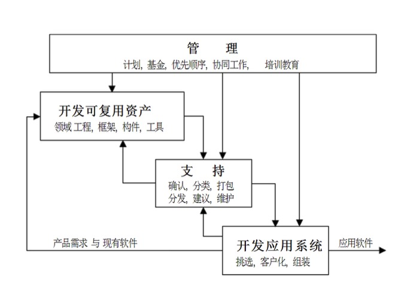
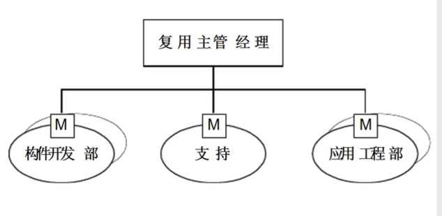
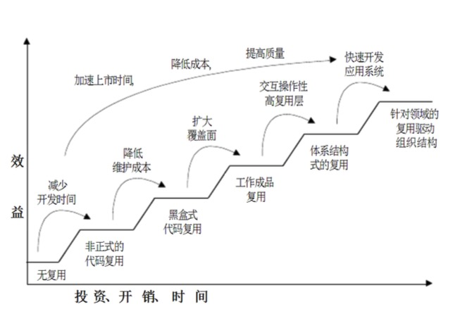
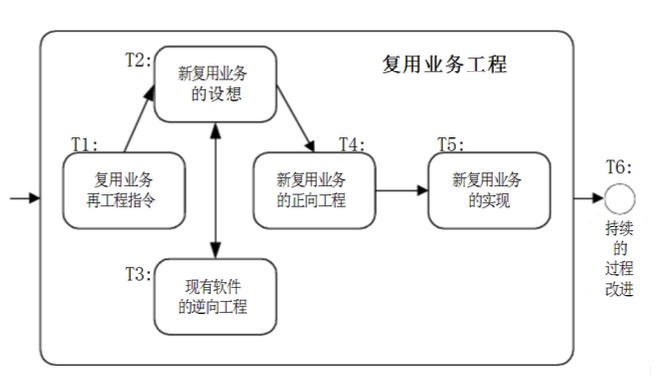

软件复用实施
---

--- 笔记整理自 北京理工大学 计算机学院

### 传统软件开发

- 企业经营方式
- 软件开发过程
- 工程技术
    * 缺乏界定复用的机制 
    * 缺乏制作可复用构件的方法 
    * 缺乏实施复用的工具
- 组织结构与管理工作 
    * 企业文化

### 复用的并行过程

    
     
    
备注：图片托管于github，请确保网络的可访问性

     

- 开发可复用资产
    * 目标：鉴定可复用资产，并为本单位提供可复用资产以满足应用工程师的需要
    * 软件开发单位所用的软件构件中有的是买的，有的是自研的(这里重点讨论)
    * 清理现有的应用软件资产，列出它的详细清单，进行领域分析，设计软件体系结构，评估应用工程师需求，可复用资产的设计实现打包等
- 开发应用系统
    * 使用可复用资产来开发客户合同所规定的应用系统的过程
    * 对可复用资产来说，这个过程就是复用的过程
    * 这个过程的活动包括：检验领域模型，收集和分析最终需求，从可复用资产中挑出合适的构件并进行必要的客户化调解，组装成完整的应用软件
    * 最后进行测试并安装到客户指定的场所
- 支持
    * 是对可复用的资产的获取，管理，维护，提供技术支持
    * 对所提供的可复用资产进行确认，对构件库进行分类编目，通告和分发可复用资产，提供必要文档，从应用工程师那里收集反馈信息等等
- 管理
    * 从事计划，基金，启动与跟踪，协调上面三个过程
    * 这个过程的活动包括：对可复用资产的购置，再工程，开发，优先性排队，筹集资金和人力，安排施工日程，组织培训，及时解决出现的矛盾

### 领域工程和应用系统工程

- 应用系统工程:针对一个应用系统
- 领域工程:针对一簇应用系统
- 领域工程为选定的领域建立模型，界定和提供可复用资产，用于支持该领域众多的应用工程
- 一般过程
    * 检验领域模型 
    * 收集分析需求 
    * 汇集可用构件 
    * 客户化调节 
    * 组装及测试

### 复用的组织机构

    
     
    
备注：图片托管于github，请确保网络的可访问性

     

- 软件复用过程的基本职能 
    * 创建可复用构件 
    * 使用可复用构件来开发系统
- 实施复用的职能部门
    * 领域工程部门(创建者) 
    * 应用工程部门(复用者) 
    * 支持部门
        * 要对构件开发部所提供的可复用资产进行确认
        * 对构件库进行分类编目
        * 对本单位的工程师发布通告和分发可复用资产,提供必要文档
        * 从复用者收集反馈信息和缺陷报告
    * 高层经理：关注总目标
        * 在跨地域的大规模的公司有时会采用复用管理委员会代替高层经理
        * 委员会包括：体系设计师和经理，力图在各个跨地域的分单位之间进行复用
        * 分单位的矛盾提交到委员会上进行讨论和裁决
        * 这种解决矛盾的周期比较长，分单位权衡下是否要将矛盾提交到委员会去解决

### 从传统过渡到复用

HP公司渐进过渡复用的经验

    
     
    
备注：图片托管于github，请确保网络的可访问性

     

- 逐步递增的实施系统复用
- 系统复用不可能自发实现，需要软件开发单位全体员工齐心协力，认真规划，仔细安排才能够逐步实现
- 软件开发企业实施系统复用的两种压力
    * 必须保持现有的传统机制继续运转，包括活动经费，以维持开发各项活动
    * 对现有传统机制进行变革，逐步过渡到系统复用状态，各级经理不熟悉新的机制，更不知道如何保持老机制运转的同时来建立新的复用机制
- 复用机制的过渡不是一件简单事，往往需要几年的时间并最好以逐步过渡的方式
    * 可以典型的示范，实行，摸索经验教训，逐步扩展，逐步增加它的复用覆盖面，最后覆盖到整个软件开发单位

### 系统复用

- 系统复用是全方位的变革
- 需要注意的核心问题
    * 复用式的业务过程 
    * 注重人员的思想 
    * 建立相关的规章和具体措施

### 迭代式过渡

- 体系结构需要稳步变革
- 组织机构的稳步变革
- 系统复用的内容与迭代式过渡框架组合

    
     
    
备注：图片托管于github，请确保网络的可访问性

     

### 遵循的原则

- 需要顶层管理和经费支持
- 先示范后推广
- 先规划体系结构及其逐步实施的过程
- 建立复用组织机构
- 进行复用工作
- 算好经济账
- 混合多种技术
- 进行文化建设和演变
- 持续投资，持续改进
- 度量复用过程和优化复用