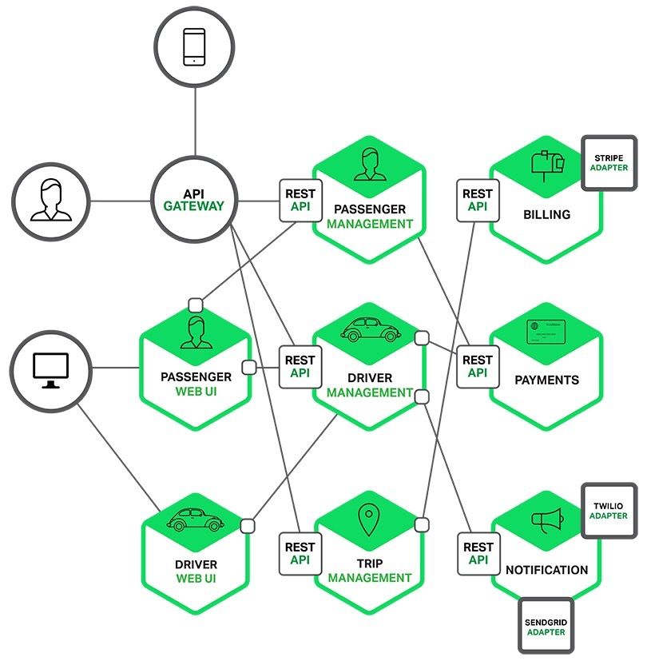

微服务架构
---

--- 笔记整理自 北京理工大学 计算机学院

### 从Dubbo说起

    
     
    
备注：图片托管于github，请确保网络的可访问性

     

**单一架构**
- Dubbo是阿里开源的一款高性能分布式服务框架，致力于提供高性能透明化的RPC远程服务调用方案以及SOA服务治理方案
- Dubbo可以和Spring系统无缝集成, 最大特点是按照分层的方式来架构，将整个框架分成10层来为服务提供方和消费方提供各自需要关心和扩展的接口,构建整个服务生态系统
- 当一个网站很小的时候只需要一个应用就可以将所有功能都部署在一起, 可以减少部署节点和成本，这时候用于简化增删改查工作量的框架ORM是关键

**垂直架构**
- 当访问量逐步增大的时候，单应用通过增加机器这样的加速度越来越小，这时候就可以将这个应用拆成互不相干的几个应用来提高效率，这时候用于加速前端开发的MVC业务框架是关键

**分布式架构**
- 当垂直应用越来越多，这种应用之间的交互变得不可避免，可以将核心的业务抽取出来作为独立的服务，逐渐形成了稳定的服务中心，使得前端应用可以快速响应多变的市场需求
- 这时候，用于提高业务复用和整合的分布式服务框架RPC是关键

**弹性计算架构**
- 当服务越来越多，容量的评估，消耗服务资源的浪费等问题逐渐显露出来的时候，就需要增加一个调度中心，基于访问压力来时时的管理集群容量，提高集群利用率
- 这时候，用来提高集群利用率的资源调度中心，就是SOA是关键
- 当业务的复杂性进一步增加的时候，我们可以采用什么架构呢?
    * 单应用或MVC应用都是一种应用的层面
    * 从RPC到SOA出现了服务的概念

### 关于RPC

    
     
    
备注：图片托管于github，请确保网络的可访问性

     

- RPC是远程的过程调用
    * 两台服务器，A和B，一个应用在A服务器上，它想要调用B服务器上的应用接口
    * 由于不再一台服务器上就需要通过网络来实现调用
    * RPC要解决的问题主要有一下几个：
        * 通讯：方法是在客户端和服务器之间建立一个TCP的连接，远程调用的所有数据都是在这个连接里面传输，连接可以是按需连接(用完即断), 也可以是长连接(多个远程调用共享同一个连接)
        * 寻址：A服务器上的应用，怎样告诉底层的RPC框架如何连接到B服务器，以特定的接口，方法的名称等
        * 序列化：A服务器上的应用发起远程调用的时候, 方法参数要通过底层网络传输, 网络协议是二进制的，参数需要进行序列化转化成二进制的形式，这种转变叫序列化
        * 反序列化：B服务器收到请求后，需要对参数进行反序列化，恢复为内存中的表达形式, 找到对应方法进行本地调用得到返回值,返回值通过序列化和反序列化的方式返回A服务器 
    * 实现RPC服务的协议
        * CORBA、Java RMI
        * Web Service、Rest API
        * ......

### 关于SOA

    
     
    
备注：图片托管于github，请确保网络的可访问性

     

- SOA是一个面向服务的体系结构模型，它将应用程序的不同功能单元(服务)，通过服务之间定义良好的接口和契约来联系起来
- 接口是采用中立的方式来定义的，应独立于实现服务的软硬件平台，操作系统，编程语言，这就使得构建在各个系统中的服务可以以一种统一的和通用的方式进行调度
- SOA架构中的三种角色
    * 服务提供者：发布自己的服务，对服务的请求进行响应
    * 服务注册中心：注册已经发布的web服务, 对他们进行分类并提供搜索服务
    * 服务请求者：利用服务中心来查找所需要的服务并使用这个服务
- SOA操作 
    * 发布操作：为了使服务可访问，需要发布服务的描述，以使服务的使用者可以发现它
    * 查找操作：服务的请求者来定位服务，方法是查询服务注册中心来找到满足它标准的服务
    * 绑定操作：在检索到服务之后，服务的使用者继续根据服务描述中的信息来处理服务
- SOA需要使用三种协议(相关标准)
    * SOAP(简单对象访问协议)：作为传输层，用于消费者和服务提供者之间传递信息
        * 一个消费者在UDDI注册查找服务，取得服务的WSDL描述，通过SOAP来调用这个服务
    * WSDL(web服务描述语言)：用于描述服务
    * UDDI(统一描述发现集成)：用于注册和查找服务

### 从SOA到微服务

- SOA将紧耦合系统拆解为面向服务的，粗粒度的，松耦合无状态的服务
    * SOA致力于将单个应用程序的功能彼此分开，以便这些功能可以作为单个应用程序的功能或组件
    * 这些组件可用于企业内部创建其他应用程序或者对外向合作者公开提供服务
- 企业服务总线ESB(Enterprise Service Bus)简化了应用间的管理
    * 是传统的中间件技术与sml，web服务等技术结合的产物
    * ESB是构建企业神经系统的必要元素
    * ESB利用总线这种模式来管理简化应用之间的集成拓扑结构
    * 以广为接受的开放标准作为基础来支持应用之间消息事件，服务级别动态上互通互联
    * 是一种在松散耦合的服务和应用之间标准的集成方式
- 微服务对业务系统进行了更加彻底的组件化和服务化
    * 单业务进一步拆分：原有单个业务系统可拆分为多个, 可独立开发，设计，运行和维护的小应用
    * 这些小应用之间通过服务进行集成和交互
    * 每个小应用从前端UI到控制层,逻辑层,数据访问,数据库完全是独立的一套
    * 在这里不用组件，而用小应用这个词更加合适
    * 每个小应用除了完成自身的业务功能之外，重点是消费外部其他应用所暴露的服务
    * 同时将自己的能力向外提供服务

### 微服务

- 在服务架构中，一组服务构成一个应用, 服务独立部署在不同进程中
- 不同服务间通过轻量级的交互机制来通信，如：RPC，HTTP等
- 服务可以扩展和伸缩，每个服务定义了明确的边界，不同服务可采用不同的编程语言来实现，由独立团队来维护
- 微服务的目的是有效的拆分应用，实现敏捷开发和部署(单个服务的变化只需重新部署服务的进程, 不影响整个应用的运行)
- 什么是微服务(Microservices)
    * 微服务架构按照业务功能划分为不同的服务
    * 每个服务要求在对应的业务领域中从前端到后端整个的软件实现，从界面到数据，存储再到外部沟通协作等
- 微服务的特征：是按业务能力来划分服务和组织团队的
- 微服务与DevOps
    * 微服务需要DevOps，也就是开发，测试，部署运维等一体化支持
    * 当单体应用被拆分为多个小应用之后, 整体架构可以松耦合和可扩展
    * 如果拆分的组件越多，这些组件之间本身的集成，部署运维就越复杂
    * 需要强化DevOps的应用才能更好的完成测试和部署工作
- 进程隔离
    * 微服务架构强调各个组件本身可以在独立的进程里工作
    * 各个组件之间在部署的时候就能做到进程级别的隔离
    * 虚拟机技术无法满足大量的进程隔离的时候，就可以使用轻量级的docker来完成
    * 每个docker是独立的容器刚好做到了进程级别的隔离，资源占用最小
    * 这些条件刚好满足微服务架构的开发测试和自动化部署
- 简化的SOA服务管理(服务管控平台)
    * 所有微服务需要一个服务管控，治理平台，虽然不需要ESB这类重组件
    * 但是要保证最基本的服务注册，服务代理，服务发布，简单的路由, 安全访问和授权，服务调度消息和日志等功能

### 微服务的优势

- 解决了复杂性问题
    * 分解巨大的单体应用为多个服务
    * 在功能不变情况下，应用被分解为多个可管理的服务
    * 每个服务通过RPC或者消息驱动API定义清楚的边界
    * 提供了一个模块化的解决方案
- 开发分工更加灵活
    * 每个服务可由单独的开发团队来开发
    * 可自由的选用开发技术来提供API服务
    * 自由表示不需要被迫使用开始的落后技术
    * 单个服务相对简单，用现在技术来重写以前的代码也不是一件很困难的事情
- 每个微服务独立部署
    * 开发者不再需要协调其他的服务部署对本服务的影响
    * 加快部署的速度，可采用AB测试快速部署变化
    * 微服务使得持续化部署成为可能
- 每个微服务可独立扩展
    * 开发者可根据每个服务的规模来部署满足需求的规模
    * 开发者可使用更适合服务需求的硬件

### 微服务的不足

- 服务过小
- 分布式系统固有的复杂性
- 分区数据库方案
- 测试复杂
- 微服务之间的依赖传递
- 部署复杂

**总结**
- 微服务的目的是有效拆分应用来实现软件的开发和部署，微服务是去中心化的分布式软件架构
- 对于业务还没有理清楚，业务数据处理能力还没有爆发式增长之前的创业公司不需要考虑微服务架构模式，更需要的是快速开发，部署和试错

### SOA与微服务的比较

<table>
    <tr>
        <th>功能</th>
        <th>SOA</th>
        <th>微服务</th>
    </tr>
    <tr>
        <td>组件大小</td>
        <td>大块业务逻辑</td>
        <td>单独任务或小块业务逻辑</td>
    </tr>
    <tr>
        <td>耦合</td>
        <td>通常松耦合</td>
        <td>总是松耦合</td>
    </tr>
    <tr>
        <td>公司架构</td>
        <td>任何类型</td>
        <td>小型、专注于功能交叉的团队</td>
    </tr>
    <tr>
        <td>管理</td>
        <td>着重中央管理</td>
        <td>着重分散管理</td>
    </tr>
    <tr>
        <td>目标</td>
        <td>确保应用能够交互操作</td>
        <td>执行新功能，快速拓展开发团队</td>
    </tr>
</table>

### 扩展

下图是一个精彩的微服务架构

    
     
    
备注：图片托管于github，请确保网络的可访问性

     

[微服务实战（一）：微服务架构的优势与不足](http://kb.cnblogs.com/page/521880/)