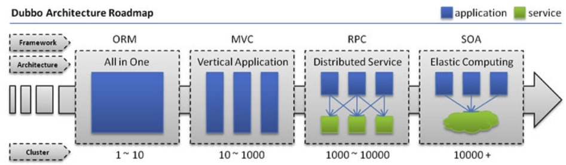
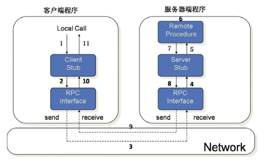
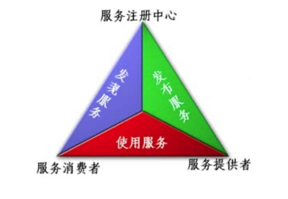

微服务架构
---

--- 笔记整理自 北京理工大学 计算机学院

### 从Dubbo说起

    
     
    
备注：图片托管于github，请确保网络的可访问性

     

- 单一架构
- 垂直架构
- 分布式架构 
- 弹性计算架构 
- 然后呢?

### 关于RPC

    
     
    
备注：图片托管于github，请确保网络的可访问性

     

- RPC为客户提供服务
    * 通讯
    * 寻址 
    * 序列化 
    * 反序列化
- 实现服务的协议
    * CORBA、Java RMI
    * Web Service、Rest API
    * ......

### 关于SOA

    
     
    
备注：图片托管于github，请确保网络的可访问性

     

- SOA的角色
    * 服务提供者
    * 服务注册中心 
    * 服务请求者
- SOA操作 
    * 发布操作
    * 查找操作
    * 绑定操作
- 相关标准
    * SOAP、WSDL、UDDI

### 从SOA到微服务

- SOA将紧耦合系统拆解为服务
- ESB简化了应用间的管理
- 微服务对业务系统进行了更加彻底的组件化和服务化
    * 单业务进一步拆分
    * 通过服务进行集成和交互
    * 消费外部服务
    * 为外部提供服务

### 微服务

- 微服务的目的是有效的拆分应用，实现敏捷开发和部署 
- 什么是微服务(Microservices)
- 微服务的特征
- 微服务与DevOps
- 进程隔离
- 简化的SOA服务管理

### 微服务的优势

- 解决了复杂性问题
- 开发分工更加灵活
- 每个微服务独立部署 
- 每个微服务可独立扩展

### 微服务的不足

- 服务过小
- 分布式系统固有的复杂性 
- 分区数据库方案
- 测试复杂
- 微服务之间的依赖传递
- 部署复杂

### SOA与微服务的比较

<table>
    <tr>
        <th>功能</th>
        <th>SOA</th>
        <th>微服务</th>
    </tr>
    <tr>
        <td>组件大小</td>
        <td>大块业务逻辑</td>
        <td>单独任务或小块业务逻辑</td>
    </tr>
    <tr>
        <td>耦合</td>
        <td>通常松耦合</td>
        <td>总是松耦合</td>
    </tr>
    <tr>
        <td>公司架构</td>
        <td>任何类型</td>
        <td>小型、专注于功能交叉的团队</td>
    </tr>
    <tr>
        <td>管理</td>
        <td>着重中央管理</td>
        <td>着重分散管理</td>
    </tr>
    <tr>
        <td>目标</td>
        <td>确保应用能够交互操作</td>
        <td>执行新功能，快速拓展开发团队</td>
    </tr>
</table>