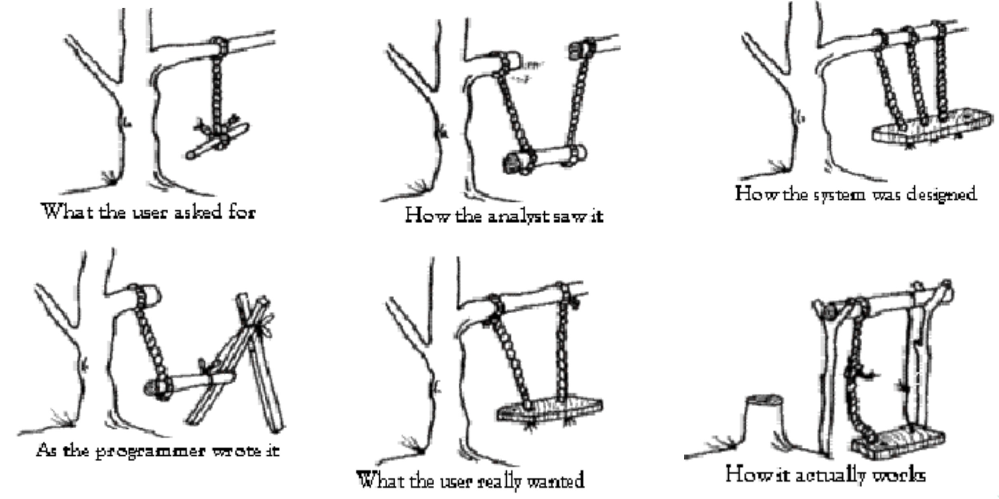
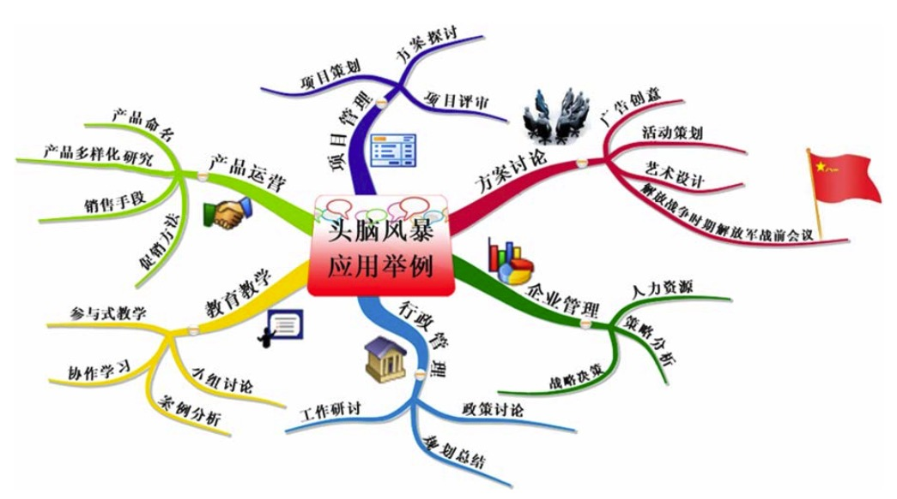
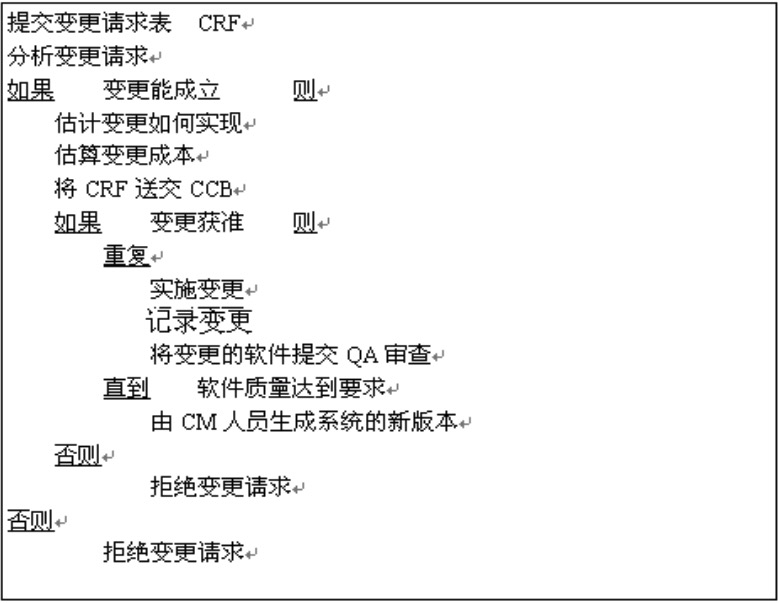
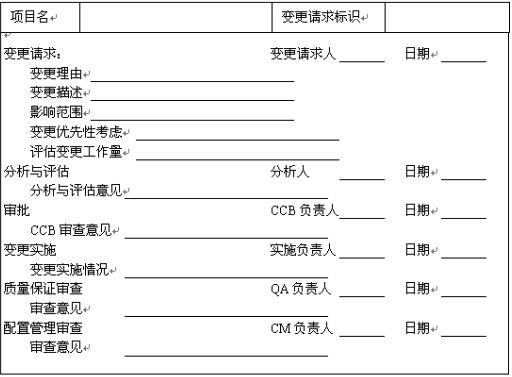
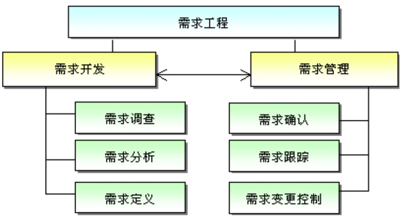

唯一不变的是变化
---

--- 笔记整理自 北京理工大学 计算机学院

### 软件开发中的一则小故事

    

备注：图片托管于github，请确保网络的可访问性

上图表示在沟通过程中的信息误解

很多时候都是这样，用户原始需求和实际交付不是一回事儿，钱也花了，时间也到了, 质量上勉强修修补补, 附带一些说明书来各种限制来勉强交付。很少一部分客户，对结果非常满意

### 需求分析的困难性

- 有几种原因使需求分析变得困难 
    * 客户说不清楚需求;
    * 需求自身经常变动;
    * 分析人员或客户理解有误。
- “据历史记载，没有一个软件的需求改动少于三次。唯一只改动需求两次的客户是个死人。这个可怜的家伙还是在运送第三次需求的路上被车子撞死的。”

### 需求捕获

捕获是需求分析的基础，巧妇难为无米之炊

Plans are nothing; planning is everything. --- Dwight D.Eisenhower

- 开发是把人们的期望转化成一种能够满足其期望的产品的过程。强调过程的重要性
- 产品什么都不是，而开发的过程就是一切。
- 发现什么都不是，而发现过程(探索过程)就是一切。

那么需求捕获到底是什么？

- 一个过程
- 一个发现的过程
- 一个试图发现的过程 
- 一个试图发现期望的过程 
- 一个试图发现对新产品的期望的过程 
- 一个试图发现客户对新产品的期望的过程

### 需求捕获方法

- 用户主诉
- 问卷调查
- 头脑风暴会议 
- 超越用户
    * 业务发展 
    * 产品数据 
    * 竞品分析
- 用户的反复无常

### 脑图工具协助捕获

Virtual your mind

    

备注：图片托管于github，请确保网络的可访问性

### 没有不变的需求

- 需求是隐藏在用户和客户内心最深处的无形东西
- 需求捕获是一切开发活动的基础
- 需求把握的程度与对客户的了解程度相关
- 需求变化是核心(典型情况下为25%的需求变化) 
- 因需求变更导致的返工占返工总量的75%-85%
- 需求变更的主要原因:客户参与项目的时间越长，他们对项目的理解就越深入。开发过程能帮助客户更好的理解自己的需求。

### 司机和汽车

- 客户是司机，确定需求的变化
- 软件开发团队是汽车，需要向客户提供方向盘，并且告知我们现在的位置和状况
- 即使看上去很顺利，司机也不应该把视线从公路上移开
- 汽车离不开司机:不能总是处于自动驾驶(巡航)状态，也就是客户公司应该派一个熟悉业务的人参与到开发公司去，时刻盯着产品方向，但实际很难做到，需要根据不同公司情况来特殊对待

### 如何应对需求变更

- 用户热衷于变更，变更让产品变得完美 
- 告诉客户变更所引起的进度和金钱成本(重点)
    * 比如从原来的5月交工到8月交工，竞争对手就会提前上市，损失的市场不可估量
    * 客户需要平衡一下相关利益，考虑是否变更
- 进行变更控制(配置管理)
    * 这是内部的一个机制，相当于开发团队的保护伞，让开发活动更有序，减少混乱
    * 让需求变更变得更有序
- 变更控制组(Change Control Board) 
    * 这是一个权力很大的机构，可以是兼职的
    * 是配置项变更的监管组织
    * 其任务是对建议的配置项变更做出评价、审批以及监督已批准的变更的实施。

### 变更请求流程

    

备注：图片托管于github，请确保网络的可访问性

### 变更请求表样例

    

备注：图片托管于github，请确保网络的可访问性

### 需求分析前的工作

- 1)确定涉众和用户类型(命名、简要描述、特征、能力); 
    * 比如一卡通的上线与售票员的失业问题，是否可以转岗或其他应对措施
    * 如果项目上线，他们一定会阻挠或者消极应对
    * 一定要处理好相关利益相关者的问题

- 2)确定涉众代表(命名、简要描述、责任、参与);
    * 公司中哪些人分为哪几类，每一类找一个说的算的代表

- 3)项目中加入涉众代表(访谈、问卷、评审、角色扮演);

- 4)创建共同的构想(问题定义、系统范围、用户目标、非功能 需求前景文档);

- 5)采用传统的需求捕获技术对需求进行捕获;

- 6)组建需求分析队伍(少量、有问题域知识)

### 需求分析时

- 在合同中一定要说清楚“做什么”和“不做什么”
- 尽可能地分析清楚哪些是稳定的需求，哪些是易变的需求。以便在进行系统设计时，将软件的核心建筑在稳定的需求上，否则将会吃尽苦头
- 必须满足和协调涉众的利益

### 有效的需求分析员

- 大多数需求分析人员都是从开发人员成长起来的
- 从数字世界到现实世界
- 教育不同，训练不同
- 一个有效的需求分析员需要在需求分析过程中和用户建立真正的伙伴关系
- 能够在错综复杂的现象中发现问题背后的问题(从表象到本质)
- 在陌生的领域内能学得更快(比如之前是汽车, 后来到医疗)
- 有效的需求分析员必须用自己的智慧、行动和真诚去发现需求、挖掘需求
- 要用共同的语言和用户进行交流
- 好的方法和习惯能够让需求分析更加有效

### 建立真正的伙伴关系

- 技术视为市场服务的
- 转变态度，具有服务意识知道用户的业务目标是什么吗? 知道用户三年甚至更久的发展方针是什么吗? 知道我们的软件能够给用户带来哪些利益吗? 用户把我们当作朋友吗?
- 培养人际关系真诚的面对客户，用真心换取真心，尽力和用户成为朋友
- 展开商业想象大胆寻求满足用户需求的更佳 途径。象用户一样看待事物远远不够，要争取看得更清晰，即“超越用户”

### 发现问题背后的问题

- 如果需求分析只是停留在表面的问题，而不能够发现用户真正关心的问题，很难相信开发出来的软件能够让用户发自内心的满意
- 用户的要求往往是开发完成某个功能(如人事管理，财务等)的软件，用来解决目前存在的问题。但是软件真正能够给用户创造的价值是什么，这是每一个需求分析员必需思考的问题
- 饭店顾客的需求，客户真的是来吃饭的，还是来找人聊天陪伴的

### 用共同的语言进行交流

- 应该努力的去熟悉用户的行业，学习用户使用的术语，标准，以便能够准确的理解用户
- 应该尽量不使用IT行业的术语，而采用浅显易懂的口头语言来解释IT行业中高深莫测的术语，以便用户能够很好的理解

### 用例设计

- 用例反映需求
- 用例联结上下游
    * 粒度过大:对设计者无用，不能提供足够的信息
    * 粒度过小:客户无法理解专业术语，无法通过良好的迭代过程获取稳 定和完整的需求
    * 用例采用半形式化描述以满足双方的要求
- 用例开发团队 
    * 人数:2-3人
    * 不同背景，不同性格的人

### 用例分析误区

- 用例分析技术包括了整个需求过程 
    * 只是一个需求分析技术，是在传统的需求捕获技术的基础上使用的，并无法替代这些技术; 
- 用例分析技术是分解技术
    * 其实用例分析技术是一种合成技术，将在需求捕获中收集而来的零散的特性合成为用例

### 适合做需求分析的人

- 乐于学习的人
- 善于学习的人
- 具有快速学习能力的人
- 能站在用户立场上思考的人
- 不以自我为中心的人
- 性格不同的人组成的小而平衡的团队

### 需求工程

把所有与需求直接相关的活动通称为需求工程

    

备注：图片托管于github，请确保网络的可访问性