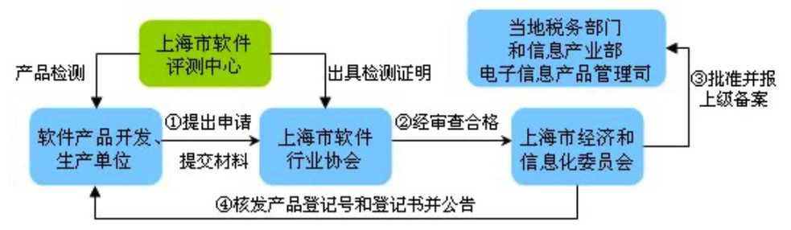

亡羊补牢为时不晚
---

--- 笔记整理自 北京理工大学 计算机学院

### 不容忽视的测试

- 亡羊补牢
- 测试不简单, 工作量很大，很累，很复杂
- 测试自动化是必由之路
- 软件产品质量不能只靠测试

### 软件测试基本原则

- 程序员应避免测试自己编写的程序; (这样是测不出来什么的)
- 测试用例的设计必须包括预期的输出结果;
- 测试用例应包括有效的和期望的输入情况，也要包括无效的和不期望的输入情况;
- 只检查程序是否做了它应该做的事这仅完成了测试工作的一半，另一半则是要检查程序是否做了它不该做的事;(后门)
- 彻底检查每个测试结果;
- 避免不可重复的即兴测试，保留全部测试用例;
- 一段程序中存在错误的概率与在这段程序中已发现的错误数成比例;
- 测试是一项非常复杂的、创造性的和需要高度智慧的挑战性任务;
- 不能为了便于测试擅自修改程序;(一定要区分开发环境,测试环境,上线环境,代码版本一定要明确,责任一定要明确)
- 测试工作必须有明确的目标;
- 尽早地和不断地进行软件测试。

### 有关测试的几个误区

- 测试范围: 代码、文档
    * 代码 + 文档
    * 维护代码和文档之间正确的对应关系
- 测试简单?
    * 测试活动已经变成了一项新的软件开发项目，很复杂
    * 测试本身就是一项新的开发，对测试用例的开发
- 什么时候开始测试?
    * 测试用例
    * 测试用例的编写应该在需求明确之后开始
- 测试可以驱动开发
    * 不再是亡羊补牢式的工作
    * TDD(Test- Driven Developement)
    * 可以引导代码的编写

### 疲于奔命捉Bug

- 编码随意 -> 编码规范
- Quickly and Ugly -> 重构 + 单元测试
- 只顾编码，不顾文档 -> 随时注释 + 文档自动化

### 捉Bug有组织有纪律

无规矩，不成方圆

- 有组织：分测试组，测试组长，测试工程师
- 有目的：压力测试还是集成测试
- 有计划：什么时候测，哪些人，哪些资源
- 有范围：测试范围是什么，哪些模块，模块之间的接口等
- 有接口：研发提供给测试接口文档
- 有数据：模拟数据，区分线上数据
- 有维护：测试脚本的维护

### 自动化捉Bug

- 有人提出可以用一种自动化的方式杀死蟑螂: 
    * 让蟑螂静止站立在砧板中间，如何做？最难的问题
    * 用蟑螂拍对准蟑螂猛拍一下
    * 把砧板、蟑螂拍上的脏东西洗干净

### CASE

- CASE工具由三个步骤组成: 
    * 分析并设计出明确的需求规格说明书 
    * 建立功能点和源代码(及文档)一一对应的数据字典
    * 将需求规格说明书转化为源代码和文档

### 测试工具

- 随着软件测试的地位逐步提高，测试的重要性逐步显现，测试工具的应用已经成为了普遍的趋势
- 目前用于测试的工具一般可分为
    * 用于测试管理(测试流程管理、缺陷跟踪管理、测试用例管理)的工具
    * 白盒测试工具
    * 黑盒测试工具
    * 性能测试工具

### 应用测试工具的目的

- 提高测试质量
- 减少测试过程中的重复劳动，提高效率
- 实现测试自动化

### 日益强大的测试工具

- WinRunner：模拟用户点击操作
- LoadRunner：模拟成千上万客户端对服务器进行测试
- Jmeter：基于Java的压力测试工具
- 等等

### 提高软件质量的方法

- 提高产品质量是一个终极目标
- 捉Bug不是唯一的办法
- 提高分析水平，设计水平，编码水平
- 提高管理水平和团队协作能力
- 提高软件开发过程开发、管理和优化
- 引入软件质量保证: SQA

### 第三方软件评测

- 国家级和省级软件评测中心
- 致力于软件工程、质量管理、软件系统测试、信息系统集成资质认证、ISO9000认证咨询、CMMI认证咨询、信息系统工程监理、信息系统验收评估等领域的研究与实践
- 示例:上海市软件评测中心进行软件产品登记测试

    

备注：图片托管于github，请确保网络的可访问性

### 扩展阅读

- [软件工程在工作中到底起多大作用？](https://www.zhihu.com/question/41338706)