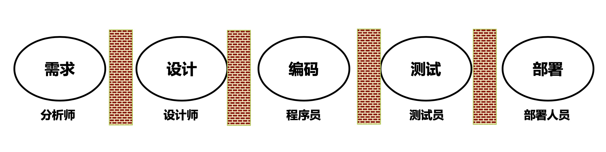
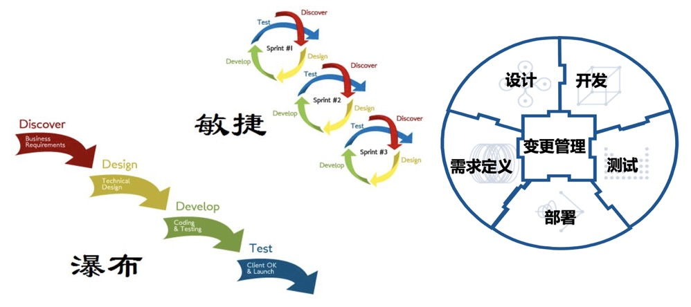

敏捷是什么
---

--- 笔记整理自 北京理工大学 计算机学院

### 典型瀑布模型开发

计划、过程管理、团队管理

需求 -》 设计 -》 编码 -》测试 -》部署

### 活动之间存在隔阂

分工明确是优点还是缺点?

    

备注：图片托管于github，请确保网络的可访问性

### 从瀑布到车轮

    

备注：图片托管于github，请确保网络的可访问性

### 敏捷宣言(对重型方法的宣战)

- 个体和交互胜过过程和工具 
- 可以工作的软件胜过面面俱到的文档 
- 客户合作胜过合同谈判
- 响应变化胜过遵循计划

### 宣言落地

- 不同的敏捷方法采用的实践不同
- 响应变化 — 快速迭代
- 客户协作 — 快速迭代
- 可工作的软件 — 持续交付
- 个体与互动 — 站会和看板

XP - SCRUM - 精益

### 敏捷特征

- 敏捷目标: 灵活和有效(言之有理，行之有效)
- 开发过程: 快速增量迭代(每个版本都有所推进，螺旋式提升)
- 管理风格: 自组织和自管理(促进式，非压制)
- 响应变化: 自适应性

不同于重型方法的预测，应对变化的方式是制定更加详尽的计划来完成的；敏捷方法则不需要制定详细的计划，通过团队建设，过程的管理来达到自适应的结果

### 灵活和有效

- 更好的响应变化的需求、更快的开发进度和更高的质量
- 方法的灵活和创新
- 有效的含义
    * 成功 (速度提高，质量提高了，团队建设了)
    * 失败 (尽早暴露了问题，及时止损，也是一种有效)

### 快速增量迭代

- 小步快跑:小版本，小周期(2周 ~ 4周)
- 随时看到效果(开发工作可视性)
- 收集反馈(感知变化)
- 随时修正(应对变化)
- 维持团队成员开发积极性

### 自组织团队

- 培养团队是关键
- 自组织与自管理
- 一个团队不只是一群人
- 成员自动自发，默契，协作，互补
- 共同的目标，共同的工作理念和文化
- 建立在团队个人能力和松散管理的基础之上
    * 开发能力(业务能力)
    * 自我约束能力(逃避责任还是承担责任)
    * 松散管理(主动认领)
    * I can, I up

### 自适应性

- 需求变更可以为客户创造竞争优势
- 需求是不稳定的和全天候的
- 对需求稳定性的判断和预测很难
- 通过建立过程的自适应性来解决不可预测性
- 原地踏步式的连续适应性变化收效甚微
- 必须是增量式适应

