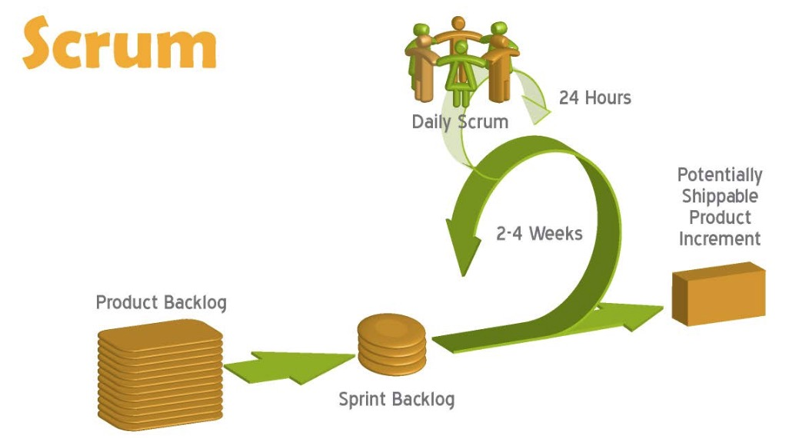
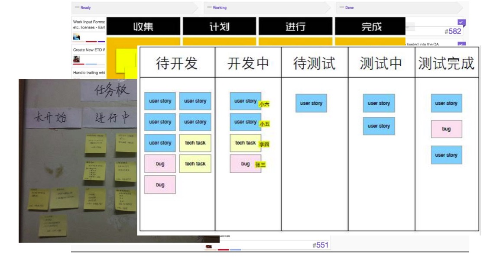
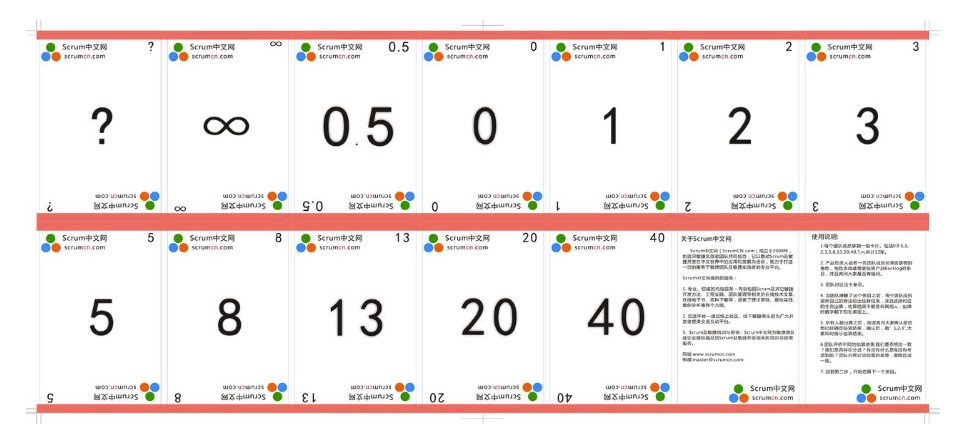
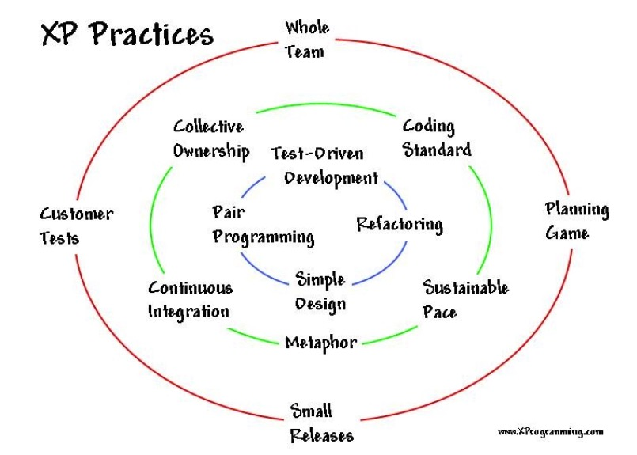
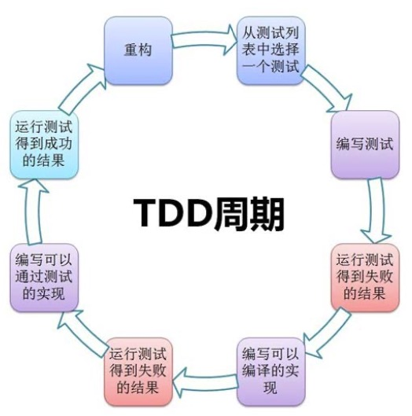

典型的敏捷开发方法:SCRUM和XP
---

--- 笔记整理自 北京理工大学 计算机学院

###  典型敏捷方法之SCRUM

- 来源于橄榄球比赛的英语， scrum vi.参加并列争球 vt.抛(球)开始并列争球 n.扭打, 混乱, 并列争球
- 团队成员像打橄榄球一样迅速、富有战斗激情、人人你争我抢地完成同一个目标
- 通过以下三点来展开：
    * SCRUM开发模型
    * SCRUM的三种角色
    * SCRUM的3个实践

### 开发模型

    

备注：图片托管于github，请确保网络的可访问性

product backlog 对应整理后的用户需求列表, 优先级对应了客户功能是否紧急

sprint backlog 对于有优先级的需求列表，开发团队拿出一天来，通过会议对这些进行分解, 分拆成更小的任务，估算完成时间，开发成员主动认领这些backlog，经过2-4周的迭代，所有的sprint backlog 就完成了一次可运行的增量的迭代

在2-4周的开发过程中，有一个过程叫做 daily scrum, 每天早上有个站立会议，更新看板

### 角色之产品负责人

Product Owner是SCRUM团队与客户之间的接口

<table>
    <tr>
        <td>建立愿景</td>
        <td>确认小组所有成员都在追求一个共同的项目愿景</td>
    </tr>
    <tr>
        <td>定义产品路标</td>
        <td>确定大的功能及客户价值</td>
    </tr>
    <tr>
        <td>确定需求</td>
        <td>生成故事描述</td>
    </tr>
    <tr>
        <td>维护Backlog</td>
        <td>确定功能优先级, 确保对即将开始的迭代故事进行了足够的细化</td>
    </tr>
    <tr>
        <td>客户验收</td>
        <td>让客户使用产品提供反馈</td>
    </tr>
    <tr>
        <td>吸引涉众参与</td>
        <td>让每一个对产品相关的人参与进来</td>
    </tr>
    <tr>
        <td>计划</td>
        <td>确定交付日期，跟踪进度</td>
    </tr>
    <tr>
        <td>协调外部资源</td>
        <td>从外部获得任何团队需要的资源</td>
    </tr>
</table>

### 角色之SCRUM master

SCRUM Master不是管理者，而是促进者

<table>
    <tr>
        <td>确保流程的贯彻执行</td>
        <td>对如何执行上达成一致,保障团队一致的执行流程</td>
    </tr>
    <tr>
        <td>找到并去除障碍</td>
        <td>找到任何妨碍团队绩效的障碍，并去除这些障碍</td>
    </tr>
    <tr>
        <td>保证内部沟通的顺畅</td>
        <td>确保团队沟通舒畅、高效</td>
    </tr>
    <tr>
        <td>维持工作环境</td>
        <td>防止团队遭受外部打扰，保护团队专注，确保团队保持工作节奏</td>
    </tr>
    <tr>
        <td>团队提高</td>
        <td>确保团队的人是适合的人，在团队中进行跨技能培训。通过激发创造性与推动授权来提升开发团队的成员能力</td>
    </tr>
</table>

### 角色之开发团队

- 主要负责软件产品在Scrum规定流程下进行开发工作 
- 人数控制在5~10人左右 
- 每个成员可能负责不同的技术方面 
- 要求每个成员必须要有很强的自我管理能力 
- 具有一定的表达能力
- 成员可以采用任何工作方式，只要能达到Sprint的目标

### 每日站会

- 每天早上
- 15分钟左右
- 每人必须发言
    * 昨天已做的
    * 今天要做的
    * 遇到的问题
- 更新看板

### 各式看板

    

备注：图片托管于github，请确保网络的可访问性

当然可以借助一些比较流行的系统工具如禅道等工具来实现

### 计划纸牌

- 用途:团队一起估算开发活动的工作量 
- 问题:新手vs高手

    

备注：图片托管于github，请确保网络的可访问性

这些也可以用禅道系统来取代

### SCRUM总结

- 规定了一个非常简单的开发流程
- 以团队的自主自发为基础
- 主要团队成员应跨职能，全职(全身心，不能想着在上班时间搞副业!!!)
- 快速、迭代、增量的开发出可交付系统
- 可以融合其他敏捷方法中的工程技术手段

### 典型敏捷方法之XP

- 极限编程(eXtreme Programming，简称XP)是一种轻量级、高效、低风险、柔性、可预测的、科学的软件开发方法 
- XP的4个价值观念
    * 沟通—大多数项目的失败源于沟通不畅，所以要进行一些能够推动积极沟通的实践
    * 简单—开发能够满足客户需要的最简单的产品
    * 反馈—开发者必须要获取并且重视来自客户、系统的反馈以及相互之间的反馈
    * 勇气—不断重构，拥抱和引导变化，以提升客户竞争优势

### XP的12个特性

    

备注：图片托管于github，请确保网络的可访问性

TDD: 是我们公认的一种非常好的测试驱动开发方法
Refactoring: 重构
Simple Design: 简单设计
Continuous Integration: 持续集成
Planing Game: 计划游戏
Small Releases: 小版本迭代交付

**计划游戏**

- 快速制定计划、随着细节的不断变化而完善 
- 要求结合项目进展和技术情况，确定下一阶段要开发与发布的系统范围 
- 当计划赶不上实际变化时就应更新计划

**小型发布**

- 系统的设计要能够尽可能早地交付
- 在非常短的周期内以递增的方式发布新版本
- 容易估计每个迭代周期的进度
- 便于控制工作量和风险
- 及时处理用户的反馈

**简单设计**

- 只处理当前的需求使设计保持简单
- 任何时候都应当将系统设计的尽可能简单
- 不必要的复杂性一旦被发现就马上去掉

**测试驱动开发**

- junit, nunit
- 先写测试代码再编写程序
- 程序员不断地编写单元测试 ，在这些测试能够准确无误地运行的情况下开发才可以继续

    

 

    

备注：图片托管于github，请确保网络的可访问性

**重构**

- 重构：狭义重构(代码)和广义重构(文档,需求,设计)
- 重新审视需求和设计，重新明确地描述它们，以符合新的和现有的需求
- 代码重构是指在不改变系统行为的前提下，重新调整 、优化系统的内部结构以减少复杂性、消除冗余、增加灵活性和提高性能
- 从重构(行动)到设计模式(高阶)

**结对编程**

- 最有争议的规则之一
- 由两个程序员在同一台电脑上共同编写解决同一问题的代码
- 通常一个人负责写编码，而另一个负责保证代码的正确性与可读性

**持续集成**

- 从 Daily Build 到 Night Build 到 Continuous Integration
- 可以按日甚至按小时为客户提供可运行的版本
- 提倡在一天中集成系统多次，而且随着需求的改变，要不断的进行回归测试，避免了一次系统集成的恶梦
- 持续集成工具的快速发展
